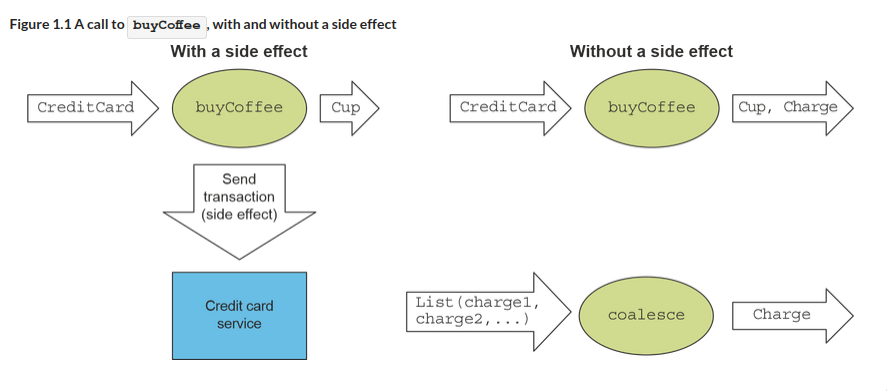
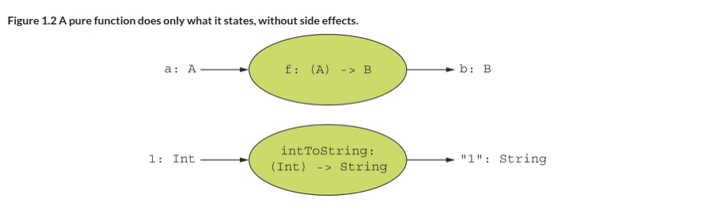

= 1 What is functional programming?
:toc:
:icons: font
:url-quickref: https://livebook.manning.com/book/functional-programming-in-kotlin/chapter-1/

{url-quickref}[See chapter online chapter].

== Imperative

[quote]

____
It means we give the computer a set of instructions or commands, one after the other. As we do so, we are changing the system’s state with each step we take.
____

* recipe - easy to follow
* difficult to reason about as it grows

== Functional programming:

[quote]
____
We construct our programs using only pure functions—in other words, functions with no side effects.
____

== Side effects

voorbeelden?

[%collapsible]
====
* Modifying a variable beyond the scope of the block where the change occurs
* Modifying a data structure in place
* Setting a field on an object
* Throwing an exception or halting with an error
* Printing to the console or reading user input
* Reading from or writing to a file
* Drawing on the screen
====

== Credit card charge

. xref:sec1/Listing1.kt[]
. xref:sec1/Listing2.kt[]
. xref:sec1/Listing3.kt[]
. xref:sec1/Listing4.kt[]
. xref:sec1/Listing5.kt[]
. xref:sec1/Listing6.kt[]

== Pure function

> A function f with input type A and output type B is a computation that relates every value a of type A to exactly one value b of type B such that b is determined solely by the value of a

== Referential Transparency (RT) and the substitution model.
> An expression e is referentially transparent if, for all programs p, all occurrences of e in p can be replaced by the result of evaluating e without affecting the meaning of p.

RT enforces the rule that everything a function does should be represented by the value it returns, according to the function’s result type

=== Not RT
StringBuilder.append:
[source,kotlin]
----
>>> val x = StringBuilder("Hello")
    res10: kotlin.text.StringBuilder = Hello

>>> val r1 = x.append(", World").toString()
    res11: kotlin.String = Hello, World

>>> val r2 = x.append(", World").toString()
    res12: kotlin.String = Hello, World, World
----

=== RT
zie algebra: + * - / ()

=> local reasoning

====
A pure function is modular and composable because it separates the computation logic from “what to do with the result” and “how to obtain the input”;
====

