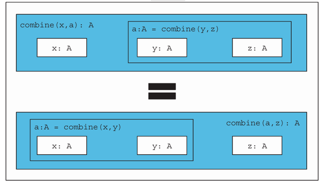
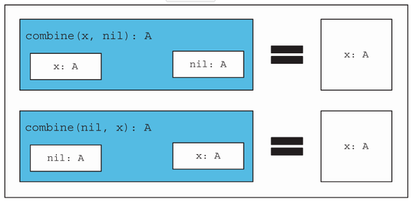
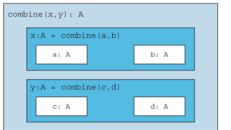

= 10 Monoids
:toc:
:icons: font
:url-quickref: https://livebook.manning.com/book/functional-programming-in-kotlin/chapter-10/

{url-quickref}[See chapter online chapter].

...look at the bigger picture. ... we’ve seen some common patterns emerging. ... The primary goal is to train you to recognize such patterns....

These abstractions should not be confused with *polymorphic hierarchies*...

...we call these abstractions *type classes*... When we recognize such a common structure in the wild among different solutions in various contexts, we unite the common instances of that structure under a single definition and give it a name.

By the end of part 2, we were getting comfortable considering data types in terms of their *algebras*. In particular, we were concerned with _the operations they support_ and the _laws that govern those operations_.

We’ll begin by considering a simple structure known as the *monoid*, which is defined only by its algebra.

...in category theory refers to *a category with one object*. Besides satisfying the same laws, instances of the monoid interface may have little or nothing to do with one another. Nonetheless, we’ll see how this algebraic structure is often all we need to write useful, polymorphic functions.

Voorbeelden:

* Working with lists,
* concatenating strings,
* accumulating a loop’s results

The chapter culminates in how monoids can be used in two real-world situations:

. they facilitate parallelization by giving us the freedom to break problems into chunks that can be computed in parallel;
. they can also be composed to assemble complex calculations from simpler parts.

== 10.1 What is a monoid?

=== string concatenation.

We can add "foo" + "bar" to get "foobar".

In addition to this, the empty string is known as an *identity element* for that operation.

====
if we say `(s + "")` or `("" + s)`, the result is always `s` for any value of `s`.

if we combine three strings by saying `(r + s + t)`, the operation is *associative*. By this we mean it doesn’t matter whether we parenthesize it: `(r + s) + t or r + (s + t)`.
====

=== integer addition.
It is *associative*: `(x + y) + z` is always equal to `x + (y + z)`.

It has an *identity* element of 0

=== multiplication.

identity element of 1.

=== boolean operators

Boolean operators && and || are likewise associative

identity elements `true` and `false`, respectively.

=== other examples of monoid
...when you go looking, algebras like this can be found wherever laws apply.

the laws of *associativity* and *identity* are collectively called the *monoid laws*.

A monoid consists of the following:

. Some type `A`
. An associative binary operation `combine`
+

. identity `nil`
+

[source,kotlin]
----
interface Monoid<A> {
    fun combine(a1: A, a2: A): A
    val nil: A
}
----

String monoid:

[source,kotlin]
----
val stringMonoid = object : Monoid<String> {

    override fun combine(a1: String, a2: String): String = a1 + a2

    override val nil: String = ""
}
----

List concatenation:

[source,kotlin]
----
fun <A> listMonoid(): Monoid<List<A>> = object : Monoid<List<A>> {

    override fun combine(a1: List<A>, a2: List<A>): List<A> = a1 + a2

    override val nil: List<A> = emptyList()
}
----

NOTE: “What is a monoid?”: a monoid is a type, together with the monoid operations and a set of laws. A monoid is an algebra and nothing more.

Give `Monoid` instances for integer addition and multiplication, as well as for Boolean operators.

[source,kotlin]
----
fun intAddition(): Monoid<Int> =

fun intMultiplication(): Monoid<Int> =

fun booleanOr(): Monoid<Boolean> =

fun booleanAnd(): Monoid<Boolean> =
----

IMPORTANT: xref:../../../test/kotlin/chapter10/exercises/ex1/listing.kt[]

NOTE: xref:../../../test/kotlin/chapter10/solutions/ex1/listing.kt[]

Give a `Monoid` instance for combining `Option` values.

[source,kotlin]
----
fun <A> optionMonoid(): Monoid<Option<A>> =

fun <A> dual(m: Monoid<A>): Monoid<A> =
----
IMPORTANT: xref:../../../test/kotlin/chapter10/exercises/ex2/listing.kt[]

NOTE: xref:../../../test/kotlin/chapter10/solutions/ex2/listing.kt[]

A function having the same argument and return type is sometimes called an *endofunction*. Write a monoid for endofunctions.

[source,kotlin]
----
fun <A> endoMonoid(): Monoid<(A) -> A> =
----

IMPORTANT: xref:../../../test/kotlin/chapter10/exercises/ex3/listing.kt[]

NOTE: xref:../../../test/kotlin/chapter10/solutions/ex3/listing.kt[]

Use the property-based testing framework to implement properties for the monoid laws of _associativity_ and _identity_. Use your properties to test some of the monoids we’ve written so far.

[source,kotlin]
----
fun <A> monoidLaws(m: Monoid<A>, gen: Gen<A>): Prop =
----

IMPORTANT: xref:../../../test/kotlin/chapter10/exercises/ex4/listing.kt[]

NOTE: xref:../../../test/kotlin/chapter10/solutions/ex4/listing.kt[]

====
Talking about monoids

a type being a monoid <--> having a monoid instance.

It is tempting to think of a `Monoid<A>` instance as being a `monoid`.

The monoid is ...

* the type
* the instance satisfying the laws.

It’s more accurate to say that the _type A forms a monoid under the operations defined by the Monoid<A> instance_.

...we might say “_type A is a monoid_” or even “_type A is monoidal_.”
====

=== What is a monoid

Just what is a monoid, then? It’s simply a `type A` and an implementation of `Monoid<A>` that satisfies the laws.

Stated otherwise, a *monoid is a type together with a binary operation (combine) over that type, satisfying associativity and having an identity element (nil)*.

What does this buy us? Like any abstraction, a monoid is helpful to the extent that _we can write generic code_, assuming only the capabilities provided by the abstraction.

=== Type class

The monoid is a *type class*

...what exactly is a type class?

...we first need to understand the role of polymorphism in functional programming. _Polymorphism_ isn’t merely restricted to _class hierarchies_, as we’ve come to know in object orientation. Functional programming draws on a concept of _ad hoc polymorphism_, where we can _apply polymorphic functions to arguments of different types_.

A type class is a _type system_ construct that can be used to implement _ad hoc polymorphism_. It does so by _adding constraints_ to type variables in parametrically polymorphic types.

== 10.2 Folding lists with monoids

Monoids have an intimate connection with lists.

Let’s take a closer look at the signatures of `foldLeft` and `foldRight` on `List` to confirm this observation:

[source,kotlin]
----
fun <A, B> foldRight(z: B, f: (A, B) -> B): B

fun <A, B> foldLeft(z: B, f: (B, A) -> B): B
----

We see the *initializer* `z`, the *combining function* `(A, B) -> B`, and the result type of `B` carried through from the initializer.

What happens if we turn `A` and `B` into a single type called `A`?

[source,kotlin]
----
fun <A> foldRight(z: A, f: (A, A) -> A): A

fun <A> foldLeft(z: A, f: (A, A) -> A): A
----

The components of a monoid fit these argument types like a glove. So if we had a `List<String>`, words, we could simply pass the `combine` and `nil` of `stringMonoid` to reduce the list with the monoid and concatenate all the strings.

[source,kotlin]
----
>>> val words = listOf("Hic", "Est", "Index")
res0: kotlin.collections.List<kotlin.String> = [Hic, Est, Index]

>>> words.foldRight(stringMonoid.nil, stringMonoid::combine)
res1: kotlin.String = HicEstIndex

>>> words.foldLeft(stringMonoid.nil, stringMonoid::combine)
res2: kotlin.String = HicEstIndex
----

NOTE: it doesn’t matter if we choose `foldLeft` or `foldRight` when folding with a `monoid`. We should get the same result in both cases. This is because the _laws of associativity and identity_ hold true. A left fold associates operations to the left, whereas a right fold associates to the right, with the identity element on the far left and right, respectively:

[source,kotlin]
----
>>> words.foldLeft("") { a, b -> a + b } == (("" + "Hic") + "Est") + "Index"
res3: kotlin.Boolean = true

>>> words.foldRight("") { a, b -> a + b } == "Hic" + ("Est" + ("Index" + ""))
res4: kotlin.Boolean = true
----

Armed with this knowledge, we can now write a function called `concatenate` that folds a list with a monoid:

[source,kotlin]
----
fun <A> concatenate(la: List<A>, m: Monoid<A>): A =
    la.foldLeft(m.nil, m::combine)
----

In some circumstances, the element type may not have a `Monoid` instance. In cases like this, we can `map` over the `list` to turn it into a type that does have an associated instance.

The function `foldMap` is used to align the types of the `list` elements so a `Monoid` instance can be applied to the `list`. Implement this function.

[source,kotlin]
----
fun <A, B> foldMap(la: List<A>, m: Monoid<B>, f: (A) -> B): B =
----

IMPORTANT: xref:../../../test/kotlin/chapter10/exercises/ex5/listing.kt[]

NOTE: xref:../../../test/kotlin/chapter10/solutions/ex5/listing.kt[]

HARD:

The `foldMap` function can be implemented using either `foldLeft` or `foldRight`. But you can also write `foldLeft` and `foldRight` using `foldMap`

[source,kotlin]
----
fun <A, B> foldRight(la: Sequence<A>, z: B, f: (A, B) -> B): B =

fun <A, B> foldLeft(la: Sequence<A>, z: B, f: (B, A) -> B): B =

----

IMPORTANT: xref:../../../test/kotlin/chapter10/exercises/ex6/listing.kt[]

NOTE: xref:../../../test/kotlin/chapter10/solutions/ex6/listing.kt[]

== 10.3 Associativity and parallelism

...we want to parallelize ... take advantage of the _associative_ aspect of the monoid ... using a technique called the *balanced fold*.

Suppose we have a sequence a, b, c, d that we’d like to reduce using a monoid.

Folding to the right:

[source,kotlin]
----
combine(a, combine(b, combine(c, d)))
----

Folding to the left:

[source,kotlin]
----
combine(combine(combine(a, b), c), d)
----

But a balanced fold looks like this:

[source,kotlin]
----
combine(combine(a, b), combine(c, d))
----

...the balanced fold allows for parallelism because the two inner combine calls are independent and can be run simultaneously.

Implement `foldMap` based on the balanced fold technique. Your implementation should use the strategy of splitting the sequence in two, recursively processing each half, and then adding the answers together using the provided `monoid`.

[source,kotlin]
----
fun <A, B> foldMap(la: List<A>, m: Monoid<B>, f: (A) -> B): B =
----

IMPORTANT: xref:../../../test/kotlin/chapter10/exercises/ex7/listing.kt[]

NOTE: xref:../../../test/kotlin/chapter10/solutions/ex7/listing.kt[]

Hard/Optional: Also implement a parallel version of `foldMap` called `parFoldMap` using the library we developed in chapter 7.

NOTE: Implement `par`, a combinator to promote `Monoid<A>` to a `Monoid<Par<A>>`, and then use this to implement `parFoldMap`.

[source,kotlin]
----
fun <A> par(m: Monoid<A>): Monoid<Par<A>> =

fun <A, B> parFoldMap(
    la: List<A>,
    pm: Monoid<Par<B>>,
    f: (A) -> B
): Par<B> =
----

IMPORTANT: xref:../../../test/kotlin/chapter10/exercises/ex8/listing.kt[]

NOTE: xref:../../../test/kotlin/chapter10/solutions/ex8/listing.kt[]

// Hard/Optional: Use `foldMap` as developed in exercise 10.7 to detect the ascending order of a `List<Int>`. This will require some creativity when deriving the appropriate Monoid instance.
//
// [source,kotlin]
// ----
// fun ordered(ints: Sequence<Int>): Boolean =
// ----
//
// IMPORTANT: xref:../../../test/kotlin/chapter10/exercises/ex9/listing.kt[]
//
// NOTE: xref:../../../test/kotlin/chapter10/solutions/ex9/listing.kt[]

== 10.4 Example: Parallel parsing

...let’s say we wanted to count the number of words in a String. This is a relatively simple parsing problem.

We could scan the string character by character, looking for whitespace and counting up the number of runs of consecutive non-whitespace characters.

It would be great if we could work with chunks of the file in parallel. The strategy would be to split the file into manageable chunks, process several chunks in parallel, and then combine the results.

----
"lorem ipsum dolor sit amet, "
----

If we split this string roughly in half, we might split it in the middle of a word. In the case of our string, that would yield `"lorem ipsum do"` and `"lor sit amet, "`.

We need to find a data structure that can handle partial results like the half words `do` and `lor` and track the complete words seen so far, like `ipsum`, `sit`, and `amet`.

[source,kotlin]
----
sealed class WC

data class Stub(val chars: String) : WC()
data class Part(val ls: String, val words: Int, val rs: String) : WC()
----

A `Stub` is the simplest case where we haven’t seen any complete words yet. A `Part` keeps the count of complete words we’ve seen so far as integer words. The value `ls` holds any partial word we’ve seen to the _left_ of those words, and `rs` holds any partial word to the _right_.

For example, counting over the string `"lorem ipsum do"` results in `Part ("lorem", 1, "do")` since there’s a single complete word, "ipsum". And since there’s no whitespace to the left of lorem or the right of do, we can’t be sure if they’re complete words or not, so we don’t count them.

Counting over `"lor sit amet, "` results in `Part("lor", 2, "")`, discarding the comma.

Write a monoid instance for WC, and ensure that it meets both monoid laws.

[source,kotlin]
----
fun wcMonoid(): Monoid<WC> =
----

IMPORTANT: xref:../../../test/kotlin/chapter10/exercises/ex10/listing.kt[]

NOTE: xref:../../../test/kotlin/chapter10/solutions/ex10/listing.kt[]

Use the `WC monoid` to implement a function that counts words in a `String` by recursively splitting it into substrings and counting the words in those substrings.

[source,kotlin]
----
fun wordCount(s: String): Int =
----

IMPORTANT: xref:../../../test/kotlin/chapter10/exercises/ex11/listing.kt[]

NOTE: xref:../../../test/kotlin/chapter10/solutions/ex11/listing.kt[]

====
Monoid homomorphisms

...you may have noticed that a law exists holding for functions between monoids.

For instance, consider the _String concatenation monoid_ and the _integer addition monoid_. If you take the lengths of two strings and add them up, it’s the same as taking the length of the concatenation of those two strings:

[source,kotlin]
----
"foo".length + "bar".length == ("foo" + "bar").length
----

Here, `length` is a function from _String to Int that preserves the monoid structure_. Such a function is called a *monoid homomorphism*. (Homomorphism comes from Greek: homo meaning “same” and morphe meaning “shape.”)

A monoid homomorphism `f` between monoids `M` and `N` obeys the following general law for all values `x` and `y`:

[source,kotlin]
----
M.combine(f(x), f(y)) == f(N.combine(x, y))
----

The same law should hold for the homomorphism from `String` to `WC` in the preceding exercises.

This property can be helpful when designing your own libraries. If two types that your library uses are monoids, and some functions exist between them, it’s a good idea to think about whether those functions are expected to preserve the monoid structure and check the monoid homomorphism law with property-based tests.

Sometimes there will be a homomorphism in _both directions_ between two monoids. If they satisfy a *monoid isomorphism* (iso- meaning “equal”), we say that the two *monoids are isomorphic*.

A monoid isomorphism between `M` and `N` has two homomorphisms, `f` and `g`, where both `f andThen g` and `g andThen f` are an `identity` function.

For example, the `String` and `Array<Char>` monoids are _isomorphic in concatenation_.

The two `Boolean` monoids `(false, ||)` and `(true, &&)` are also _isomorphic, via the ! (negation) operation_.
====

== 10.5 Foldable data structures

Chapter 3 implemented the data structures `List` and `Tree`, both of which could be folded. Then, in chapter 5, we wrote `Stream`, a lazy structure that could be folded much like `List`.

When we’re writing code that needs to process data in one of these structures, we often don’t care about the shape of the structure. It doesn’t matter if it’s a tree, a list, lazy, eager, efficiently random access, and so forth.

For example, if we have a structure full of integers and want to calculate their sum, we can use foldRight:

[source,kotlin]
----
ints.foldRight(0) { a, b -> a + b }
----

Looking at this code snippet, we _shouldn’t care about the type of ints_ at all. It could be a `Vector`, `Stream`, `List`, or `anything with a foldRight method`, for that matter. We can capture this commonality in the following interface for all these container types:

[source,kotlin]
----
interface Foldable<F> {

    fun <A, B> foldRight(fa: Kind<F, A>, z: B, f: (A, B) -> B): B

    fun <A, B> foldLeft(fa: Kind<F, A>, z: B, f: (B, A) -> B): B

    fun <A, B> foldMap(fa: Kind<F, A>, m: Monoid<B>, f: (A) -> B): B

    fun <A> concatenate(fa: Kind<F, A>, m: Monoid<A>): A =
        foldLeft(fa, m.nil, m::combine)
}
----

The `Foldable` interface declares a generic type `F` representing any container such as `Option`, `List`, or `Stream`.

We also see something new: a type called `Kind<F, A>` representing `F<A>`.

We can’t express multiple levels of generics in Kotlin type declarations, so Arrow provides us with `Kind` to declare that the _kind of `F` is an outer container for inner elements of type ``A``_.

Just as functions that take other functions as arguments are called higher-order functions, something like Foldable is a *higher-order type constructor* or a *higher-kinded type*.

====
Higher-kinded types and Kotlin

If you come from an object-oriented programming background, you know what a constructor is. In particular, a *value constructor* is a method or function that has a value applied to it to “construct” another value (object). Likewise, we have something called a *type constructor*, which is a type that allows another type to be applied to it. The result of this construction is called a *higher-kinded type*.

As an example, take the `Foldable` interface. We declare a new instance of this interface, a `ListFoldable`. This is a `Foldable` of the `List` type.

pseudocode:
[source,kotlin]
----
interface Foldable<F<A>> {
//some abstract methods
}

object ListFoldable : Foldable<List<A>> {
//some method implementations with parameterized A
}
----

On closer inspection, this is not as simple as we expected. We are dealing with a type constructor that is a `Foldable` of `F<A>`, which in the implementation is a `List<A>` but could also be a `Stream<A>`, `Option<A>`, or something else.

Notice the two levels of generics we are dealing with: `F` and `A` (or, more concretely, `List<A>` in the implementation). This nesting of kinds can’t be expressed in Kotlin and will fail compilation.

_Higher-kinded types_ are an advanced language feature that languages like Kotlin and Java do not support. Although this might change in the future, the Arrow team has provided an interim workaround for situations like this.

Appendix C goes into greater detail about how Arrow solves this problem to enable higher-kinded types in Kotlin.

====

Implement `foldLeft`, `foldRight`, and `foldMap` on the `Foldable<F>` interface in terms of each other.

[source,kotlin]
----
interface Foldable<F> {

    fun <A, B> foldRight(fa: Kind<F, A>, z: B, f: (A, B) -> B): B =

    fun <A, B> foldLeft(fa: Kind<F, A>, z: B, f: (B, A) -> B): B =

    fun <A, B> foldMap(fa: Kind<F, A>, m: Monoid<B>, f: (A) -> B): B =

}
----

IMPORTANT: xref:../../../test/kotlin/chapter10/exercises/ex12/listing.kt[]

NOTE: xref:../../../test/kotlin/chapter10/solutions/ex12/listing.kt[]

Implement `Foldable<ForList>` using the `Foldable<F>` interface from the previous exercise.

[source,kotlin]
----
object ListFoldable : Foldable<ForList>
----

IMPORTANT: xref:../../../test/kotlin/chapter10/exercises/ex13/listing.kt[]

NOTE: xref:../../../test/kotlin/chapter10/solutions/ex13/listing.kt[]

Recall that we implemented a binary Tree in chapter 3. Now, implement `Foldable<ForTree>`. You only need to override `foldMap` of `Foldable` to make this work, letting the provided `foldLeft` and `foldRight` methods use your new implementation.

A foldable version of `Tree`, along with `ForTree` and `TreeOf`, has been provided in the chapter 10 exercise boilerplate code.

[source,kotlin]
----
object TreeFoldable : Foldable<ForTree>
----
IMPORTANT: xref:../../../test/kotlin/chapter10/exercises/ex14/listing.kt[]

NOTE: xref:../../../test/kotlin/chapter10/solutions/ex14/listing.kt[]

====
The semigroup and its relation to the monoid

We began part 3 of the book with `monoids` because they are simple and easy to understand. Despite their simplicity, they can be broken down even further into smaller units called `semigroups`.
The semigroup encompasses *combinatorial aspect* of the monoid.

As we have already learned, the monoid consists of two operations: an ability to _combine_ and another to create an _empty nil_ value. *The ability to combine is known as a semigroup* and can be defined as follows:

[source,kotlin]
----
interface Semigroup<A> {
    fun combine(a1: A, a2: A): A
}
----

In other words, a monoid is the combination of a semigroup with a nil value operation and may be expressed as follows:

[source,kotlin]
----
interface Monoid<A> : Semigroup<A> {
    val nil: A
}
----

Even though we won’t be using the semigroup directly, it is still good to know that the monoid is not the simplest algebraic structure available.
====

Write an instance of `Foldable<ForOption>`.

[source,kotlin]
----
object OptionFoldable : Foldable<ForOption>
----

IMPORTANT: xref:../../../test/kotlin/chapter10/exercises/ex15/listing.kt[]

NOTE: xref:../../../test/kotlin/chapter10/solutions/ex15/listing.kt[]

Any `Foldable` structure can be turned into a `List`. Write this convenience method for `Foldable<F>` using an existing method on the interface:

[source,kotlin]
----
fun <A> toList(fa: Kind<F, A>): List<A> =
----

IMPORTANT: xref:../../../test/kotlin/chapter10/exercises/ex16/listing.kt[]

NOTE: xref:../../../test/kotlin/chapter10/solutions/ex16/listing.kt[]

== 10.6 Composing monoids

The monoids we have covered up to now were self-contained and didn’t depend on other monoids for their functionality. This section deals with _monoids that depend on other monoids_ to implement their functionality.

When considering the monoid by itself, its applications are somewhat limited. Next, we will look at ways to make it more useful by combining it with other monoids. We can achieve this by either *composing* or *nesting* monoids.

The Monoid abstraction in itself is not all that compelling, and it’s only vaguely more interesting with the generalized foldMap. The real power of monoids comes from the fact that they _compose_. In other words, _if types A and B are both monoids, they can be composed as a new monoid of Pair<A, B>_. We refer to this monoidal composition as their product.

Implement `productMonoid` by composing two monoids. Your implementation of combine should be associative as long as A.combine and B.combine are both associative.

[source,kotlin]
----
fun <A, B> productMonoid(
    ma: Monoid<A>,
    mb: Monoid<B>
): Monoid<Pair<A, B>> =
----
IMPORTANT: xref:../../../test/kotlin/chapter10/exercises/ex17/listing.kt[]

NOTE: xref:../../../test/kotlin/chapter10/solutions/ex17/listing.kt[]

=== 10.6.1 Assembling more complex monoids

One way to enhance monoids is to let them depend on one another. This section deals with assembling monoids from other monoids.

Some data structures form interesting monoids as long as the types of elements they contain also form monoids. For instance, there’s a monoid for _merging key-value pairs of Maps_, as long as the value type is a monoid.

[source,kotlin]
----
fun <K, V> mapMergeMonoid(v: Monoid<V>): Monoid<Map<K, V>> =
    object : Monoid<Map<K, V>> {
        override fun combine(a1: Map<K, V>, a2: Map<K, V>): Map<K, V> =
            (a1.keys + a2.keys).foldLeft(nil, { acc, k ->
                acc + mapOf(
                    k to v.combine(
                        a1.getOrDefault(k, v.nil),
                        a2.getOrDefault(k, v.nil)
                    )
                )
            }
        )
        override val nil: Map<K, V> = emptyMap()
    }
----
We can now assemble complex monoids quickly by using this simple mapMergeMonoid combinator as follows:

[source,kotlin]
----
val m: Monoid<Map<String, Map<String, Int>>> =
    mapMergeMonoid<String, Map<String, Int>>(
        mapMergeMonoid<String, Int>(
            intAdditionMonoid
        )
    )
----

This allows us to combine nested expressions using the monoid with no additional programming. Let’s take this to the REPL:

[source,kotlin]
----
>>> val m1 = mapOf("o1" to mapOf("i1" to 1, "i2" to 2))
>>> val m2 = mapOf("o1" to mapOf("i3" to 3))

>>> m.combine(m1, m2)

res0: kotlin.collections.Map<kotlin.String,kotlin.collections.Map<
kotlin.String, kotlin.Int>> = {o1={i1=1, i2=2, i3=3}}
----

By nesting monoids, we have now merged a nested data structure by issuing a single command.

Next, we will look at a monoid that _emits a function as a monoid_.

Write a monoid instance for functions whose results themselves are monoids.

[source,kotlin]
----

fun <A, B> functionMonoid(b: Monoid<B>): Monoid<(A) -> B> =

)
----

IMPORTANT: xref:../../../test/kotlin/chapter10/exercises/ex18/listing.kt[]

NOTE: xref:../../../test/kotlin/chapter10/solutions/ex18/listing.kt[]

A `bag` is like a `set`, except that it’s represented by a `map` that contains one entry per element. Each element is the key, and the value is the number of times the element appears in the bag. For example:

[source,kotlin]
----
>>> bag(listOf("a", "rose", "is", "a", "rose"))

res0: kotlin.collections.Map<kotlin.String, kotlin.Int> = {a=2, rose=2, is=1}
----

Use monoids to compute such a bag from a List<A>.
[source,kotlin]
----
fun <A> bag(la: List<A>): Map<A, Int> =
----

IMPORTANT: xref:../../../test/kotlin/chapter10/exercises/ex19/listing.kt[]

NOTE: xref:../../../test/kotlin/chapter10/solutions/ex19/listing.kt[]

=== 10.6.2 Using composed monoids to fuse traversals

Sometimes we require several calculations to be applied to a `list`, resulting in *multiple traversals* to get the results. This section describes how we can use monoids to perform these calculations simultaneously during a single traversal.

Multiple monoids can be composed into one, which means we can perform multiple calculations together when folding a data structure. For example, we can take the length and sum of a list simultaneously to calculate the mean.

[source,kotlin]
----
>>> val m = productMonoid<Int, Int>(intAdditionMonoid, intAdditionMonoid)
>>> val p = ListFoldable.foldMap(List.of(1, 2, 3, 4), m, { a -> Pair(1, a) })

res0: kotlin.Pair<kotlin.Int, kotlin.Int> = (4, 10)

>>> val mean = p.first / p.second.toDouble()
>>> mean

res1: kotlin.Double = 0.4

----

It can be tedious to assemble monoids by hand using `productMonoid` and `foldMap`. Part of the problem is that we’re building up the `Monoid` separately from the mapping function of `foldMap`, and we must manually keep these “aligned” as we did here.

A better way would be to create a _combinator_ library that makes it more convenient to assemble these composed monoids. Such a library could define complex computations that may be parallelized and run in a single pass. This is beyond the scope of the chapter but certainly worth exploring as a fun project if this fascinates you.

In this chapter, we introduced one of the most straightforward purely algebraic abstractions, the _monoid_. When you start looking for it, you’ll find ample opportunity to exploit the monoidal structure in your own libraries. The associative property enables folding any `Foldable` data type and gives the flexibility of doing so in _parallel_. Monoids are also _compositional_, and you can use them to assemble folds in a declarative and reusable way.

Monoid has been our first purely abstract algebra, defined only in terms of its abstract operations and the laws that govern them. We saw how we can still write useful functions that know nothing about their arguments except that their type forms a monoid.

====
Summary

* A purely algebraic structure is a declarative abstraction of laws that enforces these laws when writing polymorphic functions.
* The monoid is an algebraic structure that upholds the laws of associativity and identity and is defined by a type with operations that uphold these laws.
* Monoid operations are closely related to fold operations and are most often used for such operations.
* Balanced folds are highly effective in parallelization and are a natural fit for monoids.
* Higher-kinded types allow abstraction of operations to promote code reuse across multiple implementations and are types that take other types to construct new types.
* Monoids may be composed to form products that represent more complex monoidal structures.
* Multiple operations can be applied simultaneously with composed monoids, thus preventing unnecessary list traversal.
====
