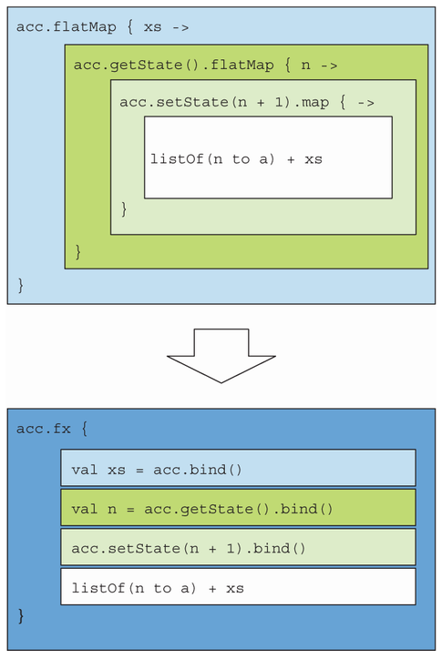

= 11 Monads and functors
:toc:
:icons: font
:url-quickref: https://livebook.manning.com/book/functional-programming-in-kotlin/chapter-11/

{url-quickref}[See chapter online chapter].

> Many of us break out in cold sweat on hearing the word monad. We have visions of people in lofty ivory towers, wholly disconnected from reality, looking down on the rest of humanity with disdain. We hear them mumbling academic concepts that have little or no bearing on the real world.

> ...there is nothing to fear.

Chapter 10 introduced a simple algebraic structure, the *monoid*. This was our first instance of a completely abstract, purely algebraic interface, also known as a *type class*. It led us to think about interfaces in a new way that is unlike an object-oriented view. That is, a useful interface may be defined only by a collection of operations related by laws.

== 11.1 Functors

=== 11.1.1 Defining the functor by generalizing the map function

In parts 1 and 2, we implemented several different combinator libraries. In each case, we wrote a small set of primitives and then several combinators defined purely in terms of those primitives. ... similarities ... For instance, we implemented a `map` function for each data type to _lift_ a function, transforming one argument “in the context of” some data type. For `Option`, `Gen`, and `Parser`, the type signatures were as follows:

[source,kotlin]
----
fun <A, B> map(ga: Option<A>, f: (A) -> B): Option<B>

fun <A, B> map(ga: Gen<A>, f: (A) -> B): Gen<B>

fun <A, B> map(ga: Parser<A>, f: (A) -> B): Parser<B>
----

These type signatures differ _only in the concrete data type_ (`Option`, `Gen`, or `Parser`). We can capture this idea with a Kotlin interface called `Functor` as a data type that *implements map*.

[source,kotlin]
----
interface Functor<F> {
    fun <A, B> map(fa: Kind<F, A>, f: (A) -> B): Kind<F, B>
}
----

Here we parameterize `map` on the type constructor, `Kind<F, A>`, much like we did with `Foldable`.

Recall that a *type constructor* is applied to a type to produce another type. For example, `List` is a type constructor, *not a type*. There are no values of type List, but we can apply it to the type `Int` to produce the type `List<Int>`. Likewise, `Parser` can be applied to `String` to yield `Parser<String>`. Instead of picking a particular `Kind<F, A>`, like `Gen<A>` or `Parser<A>`, the `Functor` interface is parametric in the choice of `F`. Here’s an instance for `List`:

[source,kotlin]
----
val listFunctor = object : Functor<ForList> {
    override fun <A, B> map(fa: ListOf<A>, f: (A) -> B): ListOf<B> =
        fa.fix().map(f)
}
----

NOTE: We draw on the `Kind` type and its related _boilerplate code_ to express higher-kinded types in Kotlin.

We say that a type constructor like `List` (or `Option`, or `F`) is a `functor`, and the `Functor<F>` instance constitutes proof that `F` is a functor.

What can we do with this abstraction? We can discover useful functions just by playing with the operations of the interface in a purely algebraic way. Let’s see what (if any) valuable operations we can define only in terms of `map`.

For example, if we have `F<Pair<A, B>>`, where `F` is a functor, we can “distribute” `F` over the pair to get `Pair<F<A>, F<B>>`:

[source,kotlin]
----
fun <A, B> distribute(
    fab: Kind<F, Pair<A, B>>
): Pair<Kind<F, A>, Kind<F, B>> =
    map(fab) { it.first } to map(fab) { it.second }
----

We wrote this by merely following the types, but let’s think about what it means for concrete data types like `List`, `Gen`, `Option`, and so on.

For example, if we distribute a `List<Pair<A, B>>`, we get two lists of the same length, one with all the ``A``s and the other with all the ``B``s. That operation is sometimes called `unzip`. So we just wrote a generic `unzip` function that works not just for lists but for *any functor*!

And when we have an operation on a *product* like this, we should see if we can construct the opposite operation over a *sum or coproduct*. Coproduct is the term in category theory given to a _disjoint union_, or `Either`, as we have come to know it so far.

In our case, given a _coproduct of higher kinds_, we should get back a _kind of coproducts_. We will call this `codistribute`:

[source,kotlin]
----
fun <A, B> codistribute(
    e: Either<Kind<F, A>, Kind<F, B>>
): Kind<F, Either<A, B>> =
    when (e) {
        is Left -> map(e.a) { Left(it) }
        is Right -> map(e.b) { Right(it) }
}
----

What does `codistribute` mean for `Gen`?

If we have either a _generator for A_ or a _generator for B_, we can construct a _generator that produces either A or B_ depending on which generator we actually have.

We just came up with two general and potentially useful combinators based purely on the abstract interface of `Functor`. We can reuse them for any type that allows implementation of map.

=== 11.1.2 The importance of laws and their relation to the functor

Whenever we create an abstraction like `Functor`, we should consider what *abstract methods* it should have and the *laws* we expect it to hold for the implementations.

The laws you stipulate for abstraction are entirely up to you. If you borrow the name of an existing mathematical abstraction like functor or monoid, we recommend using the laws already specified by mathematics.

Laws are important for two reasons:

* Laws help an interface form a new semantic level whose algebra may be reasoned about independently of the instances. For example, when we take the product of `Monoid<A>` and `Monoid<B>` to form `Monoid<Pair<A,B>>`, the monoid laws let us conclude that the *“fused” monoid operation is also associative*. We don’t need to know anything about A and B to conclude this.
* On a concrete level, we often rely on laws when writing various combinators derived from the functions of an abstract interface like `Functor`.

For `Functor`, we’ll stipulate the familiar law: the relation between the `map` combinator and an `identity` function as follows.

[source,kotlin]
----
map(x) { a -> a } == x
----

In other words, _mapping over a structure x with the identity function should itself be an identity_. The law captures the requirement that *map(x) “preserves the structure” of x*. Implementations satisfying this law are restricted from doing strange things like throwing exceptions, removing the first element of a `List`, converting a `Some` to `None`, and so on. Only the elements of the structure are modified by `map`; the shape or structure itself is left intact. Note that this law holds for `List`, `Option`, `Par`, `Gen` and most other data types that define `map`!

To give a concrete example of this preservation of the structure, we can consider `distribute` and `codistribute`, defined earlier. Here are the corresponding signatures, for reference:

[source,kotlin]
----
fun <A, B> distribute(
    fab: Kind<F, Pair<A, B>>
): Pair<Kind<F, A>, Kind<F, B>>

fun <A, B> codistribute(
    e: Either<Kind<F, A>, Kind<F, B>>
): Kind<F, Either<A, B>>
----

Since we know nothing about `F` other than that it is a functor, the law assures us that the returned values will have the *same shape* as the arguments. If the input to distribute is a list of pairs, the returned pair of lists will be of the same length as the input, and corresponding elements will appear in the same order.

== 11.2 Monads: Generalizing the flatMap and unit functions

...there aren’t many practical operations that can be defined purely in terms of `map`. Instead, let’s focus our attention on the more interesting interface called `Monad`, which adds to the functionality of `Functor`.

Recall that we have implemented `map2` to “lift” a function taking two parameters for several of the data types in this book. For `Gen`, `Parser`, and `Option`, the `map2` function can be implemented as follows.

[source,kotlin]
----
fun <A, B, C> map2(
    fa: Gen<A>,
    fb: Gen<B>,
    f: (A, B) -> C
): Gen<C> =
    flatMap(fa) { a -> map(fb) { b -> f(a, b) } }

fun <A, B, C> map2(
    fa: Parser<A>,
    fb: Parser<B>,
    f: (A, B) -> C
): Parser<C> =
    flatMap(fa) { a -> map(fb) { b -> f(a, b) } }

fun <A, B, C> map2(
    fa: Option<A>,
    fb: Option<B>,
    f: (A, B) -> C
): Option<C> =
    flatMap(fa) { a -> map(fb) { b -> f(a, b) } }
----

Despite operating on data types that seemingly have nothing to do with one another, the implementations are identical! The only thing that differs is the data type being operated on. ... these are particular instances of a more general pattern.

=== 11.2.1 Introducing the Monad interface

Monads are everywhere! In fact, this is what unites `Parser`, `Gen`, `Par`, `Option`, and many of the other data types we’ve looked at so far. Much as we did with `Foldable` and `Functor`, we can come up with a Kotlin interface for `Monad` that defines `map2` and numerous other functions once and for all, rather than having to duplicate their definitions for every concrete data type.

Let’s start by introducing a new interface, which we’ll call `Mon` for now.

[source,kotlin]
----
interface Mon<F> {

    fun <A, B, C> map2(
        fa: Kind<F, A>,
        fb: Kind<F, B>,
        f: (A, B) -> C
    ): Kind<F, C> =
        flatMap(fa) { a -> map(fb) { b -> f(a, b) } }    z
}
----

In this example, we’ve just taken the implementation of `map2` and changed `Parser`, `Gen`, and `Option` to the polymorphic `F` of the `Mon<F>` interface in the signature. ... in this polymorphic context, the implementation won’t compile! We don’t know anything about `F` here, so we certainly don’t know how to `flatMap` or map over a `Kind<F, A>`!

What we can do is simply add `map` and `flatMap` to the `Mon` interface and keep them abstract.

[source,kotlin]
----
fun <A, B> map(fa: Kind<F, A>, f: (A) -> B): Kind<F, B>

fun <A, B> flatMap(fa: Kind<F, A>, f: (A) -> Kind<F, B>): Kind<F, B>
----

This translation was rather mechanical. ... Our current set of primitives is `map` and `flatMap`, from which we can derive `map2`. Do `flatMap` and `map` form a minimal set of primitives? Well, the data types that implemented `map2` all had a `unit`, and we know that `map` can be implemented in terms of `flatMap` and `unit` — for example, on `Gen`:

[source,kotlin]
----
fun <A, B> map(fa: Gen<A>, f: (A) -> B): Gen<B> =
    flatMap(fa) { a -> unit(f(a)) }
----

So let’s pick `flatMap` and `unit` as our minimal set of primitives.

We’ll unify all data types under a single concept that has these functions defined. The interface will be called `Monad` and have abstract declarations of `flatMap` and `unit` while providing default implementations for `map` and `map2` in terms of our abstract primitives.

[source,kotlin]
----
interface Monad<F> : Functor<F> {

    fun <A> unit(a: A): Kind<F, A>

    fun <A, B> flatMap(fa: Kind<F, A>, f: (A) -> Kind<F, B>): Kind<F, B>

    override fun <A, B> map(
        fa: Kind<F, A>,
        f: (A) -> B
    ): Kind<F, B> =
        flatMap(fa) { a -> unit(f(a)) }

    fun <A, B, C> map2(
        fa: Kind<F, A>,
        fb: Kind<F, B>,
        f: (A, B) -> C
    ): Kind<F, C> =
        flatMap(fa) { a -> map(fb) { b -> f(a, b) } }
}
----

==== What the monad name means

We could have called `Monad` anything, like `FlatMappable`, `Unicorn`, or `Bicycle`. But monad is already a perfect name in everyday use. The name comes from *category theory*. The name _monad_ is intentionally similar to _monoid_, and the two concepts are related profoundly.

Implement the `Monad` instance for `Gen`.

[source,kotlin]
----
object Monads {

    val genMonad = object : Monad<ForGen> {

        override fun <A> unit(a: A): GenOf<A> = Gen.unit(a)

        override fun <A, B> flatMap(
            fa: GenOf<A>,
            f: (A) -> GenOf<B>
        ): GenOf<B> =
            fa.fix().flatMap { a: A -> f(a).fix() }
    }
}
----

We only need to implement `flatMap` and `unit`, and we get `map` and `map2` at no additional cost.

Write monad instances for `Par`, `Option`, and `List`. Additionally, provide monad instances for `arrow.core.ListK` and `arrow.core.SequenceK`.

NOTE: the `ListK` and `SequenceK` types provided by Arrow are _wrapper classes_ that turn their platform equivalents, `List` and `Sequence`, into fully equipped type constructors.

[source,kotlin]
----
object Monads {

    fun parMonad(): Monad<ForPar> =

    fun optionMonad(): Monad<ForOption> =

    fun listMonad(): Monad<ForList> =

    fun listKMonad(): Monad<ForListK> =

    fun sequenceKMonad(): Monad<ForSequenceK> =
}
----

NOTE: xref:../../../test/kotlin/chapter11/exercises/ex1/listing.kt[]
xref:../../../test/kotlin/chapter11/solutions/ex1/listing.kt[]

Hard: `State` looks like it could be a monad, too, but it takes two type arguments: `S` and `A`. You need a _type constructor_ of only *one argument* to implement `Monad`.

Try to implement a `State` monad, see what issues you run into, and think about how you can solve them.

[source,kotlin]
----
data class State<S, out A>(val run: (S) -> Pair<A, S>) : StateOf<S, A>
----

NOTE: xref:../../../test/kotlin/chapter11/exercises/ex2/listing.kt[]
xref:../../../test/kotlin/chapter11/solutions/ex2/listing.kt[]

NOTE: See xref:../chapter10/higherkind.adoc#_c_2_partially_applied_type_constructors[]

== 11.3 Monadic combinators

==== Sequence and traverse

Implement them once and for all on `Monad<F>`.

[source,kotlin]
----
fun <A> sequence(lfa: List<Kind<F, A>>): Kind<F, List<A>> =

fun <A, B> traverse(
    la: List<A>,
    f: (A) -> Kind<F, B>
): Kind<F, List<B>> =
----
NOTE: xref:../../../test/kotlin/chapter11/exercises/ex3/listing.kt[]
xref:../../../test/kotlin/chapter11/solutions/ex3/listing.kt[]

==== Replicate
One combinator we saw for `Gen` and `Parser` was `listOfN`, which allowed us to _replicate a generator or parser n times to get a parser or generator of lists of that length_. We can implement this combinator for all monads `F` by adding it to our `Monad` interface. We could also give it a more generic name such as `replicateM`, meaning “replicate in a monad.”

Implement `replicateM` to generate a `Kind<F, List<A>>`, with the list being of length n.

[source,kotlin]
----

fun <A> replicateM(n: Int, ma: Kind<F, A>): Kind<F, List<A>> =

fun <A> _replicateM(n: Int, ma: Kind<F, A>): Kind<F, List<A>> =
----

NOTE: xref:../../../test/kotlin/chapter11/exercises/ex4/listing.kt[]
xref:../../../test/kotlin/chapter11/solutions/ex4/listing.kt[]

Think about how `replicateM` will behave for various choices of `F`. For example, how does it behave in the `List` monad? And what about `Option`?

==== Product
There was also a combinator for our `Parser` data type called `product`, which _took two parsers and turned them into a parser of pairs_. We implemented this product combinator in terms of `map2`. We can also write it generically for any monad `F`.

[source,kotlin]
----
fun <A, B> product(
    ma: Kind<F, A>,
    mb: Kind<F, B>
): Kind<F, Pair<A, B>> =
    map2(ma, mb) { a, b -> a to b }
----

==== filter

Hard: Here’s an example of a function we haven’t seen before.

Implement the function `filterM`. It’s a bit like filter, except that instead of a function from `(A) -> Boolean`, we have an `(A) -> Kind<F, Boolean>`.

Implement this function, and then think about what it means for various data types such as `Par`, `Option`, and `Gen`.

[source,kotlin]
----
fun <A> filterM(
    ms: List<A>,
    f: (A) -> Kind<F, Boolean>
): Kind<F, List<A>> =
----

NOTE: xref:../../../test/kotlin/chapter11/exercises/ex6/listing.kt[]
xref:../../../test/kotlin/chapter11/solutions/ex6/listing.kt[]

== 11.4 Monad laws

Algebraic concepts like monads and functors are embodiments of the laws that define and govern them. In this section, we introduce the laws that govern our `Monad` interface. Certainly, we’d expect the functor laws to also hold for `Monad`, since a `Monad<F>` is a `Functor<F>`, but what else do we expect? What laws should constrain `flatMap` and `unit`? In short, we can cite several laws that fulfill these constraints:

* The associative law
* The left identity law
* The right identity law

This section looks at each one, all while proving that they hold for the monad.

=== 11.4.1 The associative law

The first monadic law we will look into is the *associative law*. This law is all about the ordering of operations. Let’s look at this by way of example.

If we want to _combine three monadic values into one_, which two should we combine first? Should it matter? To answer this question, let’s step away from the abstract level for a moment and look at a simple, concrete example using the `Gen` monad.

Say we’re testing a product order system, and we need to generate some fake orders as a fixture for our test. We might have an `Order` data class and a generator for that class.

[source, kotlin]
----
data class Order(val item: Item, val quantity: Int)
data class Item(val name: String, val price: Double)

val genOrder: Gen<Order> =
    Gen.string().flatMap { name: String ->
        Gen.double(0..10).flatMap { price: Double ->
            Gen.choose(1, 100).map { quantity: Int ->
                Order(Item(name, price), quantity)
            }
        }
    }
----

Here we’re generating the `Item` inline (from name and price), but there might be places where we want to generate an `Item` separately. We can pull that into its own generator:

[source, kotlin]
----
val genItem: Gen<Item> =
    Gen.string().flatMap { name: String ->
        Gen.double(0..10).map { price: Double ->
            Item(name, price)
        }
    }
----

This can now in turn can be used to generate orders:

[source, kotlin]
----
val genOrder2: Gen<Order> =
    Gen.choose(1, 100).flatMap { quantity: Int ->
        genItem.map { item: Item ->
            Order(item, quantity)
        }
    }
----

And that should do exactly the same thing, right? It seems safe to assume so. But not so fast! How can we be sure? It’s not exactly the same code!

Let’s expand the implementation of `genOrder` into calls to `map` and `flatMap` to better see what’s going on:

[source, kotlin]
----
val genOrder3: Gen<Order> =
    Gen.choose(1, 100).flatMap { quantity: Int ->
        Gen.string().flatMap { name: String ->
            Gen.double(0..10).map { price: Double ->
                Order(Item(name, price), quantity)
            }
        }
    }
----

When we compare this, we can clearly see that they are *not identical*, yet it seems perfectly reasonable to assume that the two implementations do precisely the same thing. Even though the order has changed, it would be surprising and weird if they didn’t. It’s because we’re assuming that `flatMap` obeys an *associative law*.

Law of associativity in terms of flatMap:
[source, kotlin]
----
x.flatMap(f).flatMap(g) == x.flatMap { a -> f(a).flatMap(g) }
----

And this law should hold for *all values x, f, and g* of the appropriate types — not just for `Gen` but for `Parser`, `Option`, or any other monad.

=== 11.4.2 Proving the associative law for a specific monad

Up to this point, we’ve been working strictly at an abstract level. But what bearing does this have on a real-world situation? How does this apply to the data types we have dealt with in past chapters? To find out, let’s prove that this law holds for `Option`. All we have to do is substitute `None` or `Some(v)` for `x` in the preceding equation and expand both its sides. We will start with the case where x is `None`:

[source, kotlin]
----
None.flatMap(f).flatMap(g) == None.flatMap { a -> f(a).flatMap(g) }
----

Since `None.flatMap(f)` is `None` for all `f`, this can be simplified to

[source, kotlin]
----
None == None
----

In other words, the law holds for `None`.

Let’s confirm that the same is true when x is `Some(v)` for an arbitrary value `v`.

[source, kotlin]
----
x.flatMap(f).flatMap(g) == x.flatMap { a -> f(a).flatMap(g) }

Some(v).flatMap(f).flatMap(g) == Some(v).flatMap { a -> f(a).flatMap(g) }

f(v).flatMap(g) == { a: Int -> f(a).flatMap(g) }(v)

f(v).flatMap(g) == f(v).flatMap(g)
----

Thus we can conclude that this law also holds when x is `Some(v)` for any value of `v`.

We can so conclude that the law holds for both cases of `Option`.

==== Kleisli composition: A clearer view of the associative law

It’s not so easy to recognize the law of associativity in the preceding example. In contrast, remember how clear the associative law for monoids was?

[source, kotlin]
----
combine(combine(x,y), z) == combine(x, combine(y,z))
----

Our associative law for monads looks nothing like that!

Fortunately for us, there is a way to make this law clearer by considering monadic functions instead of monadic values as we have been doing up to now.

What exactly do we mean by a *monadic function*, and how does it differ from the monadic values we have seen so far?

> If a monadic value is an instance of `F<A>`, a monadic function is a function in the form `(A) -> F<B>`.

A function such as this is known as a *Kleisli arrow* and is named after the Swiss mathematician Heinrich Kleisli. What makes Kleisli arrows unique is that they _can be composed with each other_:

[source, kotlin]
----
fun <A, B, C> compose(
    f: (A) -> Kind<F, B>,
    g: (B) -> Kind<F, C>
): (A) -> Kind<F, C>
----

Implement the following Kleisli composition function in `Monad`:

[source, kotlin]
----
fun <A, B, C> compose(
    f: (A) -> Kind<F, B>,
    g: (B) -> Kind<F, C>
): (A) -> Kind<F, C> =
----

NOTE: xref:../../../test/kotlin/chapter11/exercises/ex7/listing.kt[]
xref:../../../test/kotlin/chapter11/solutions/ex7/listing.kt[]

Considering that `flatMap` takes a `Kleisli arrow` as a parameter, we can now state the _associative law_ for monads using this new function in a far more symmetric way.

[source, kotlin]
----
compose(compose(f, g), h) == compose(f, compose(g, h))
----

Hard: Implement `flatMap` in terms of an abstract definition of `compose`. By this, it seems as though we’ve found another minimal set of monad combinators: `compose` and `unit`.

[source, kotlin]
----
fun <A, B> flatMap(
    fa: Kind<F, A>,
    f: (A) -> Kind<F, B>
): Kind<F, B> =
----

NOTE: xref:../../../test/kotlin/chapter11/exercises/ex8/listing.kt[]
xref:../../../test/kotlin/chapter11/solutions/ex8/listing.kt[]

==== Verifying associativity in terms of flatMap and compose

We expressed the associative law for monads in terms of `flatMap`. We then chose a more straightforward representation of this law using `compose`. In this section, we prove that the two proofs are equivalent by applying the substitution model to the law expressed in terms of `compose` using the implementation in terms of `flatMap`. We will look at one side at a time for the sake of simplicity. Let’s focus on the left side of the equation first.

[source, kotlin]
----
compose(compose(f, g), h)

{ a -> flatMap(compose(f, g)(a), h) }

{ a -> flatMap({ b: A -> flatMap(f(b), g) }(a), h) }

{ a -> flatMap(flatMap(f(a), g), h) }

flatMap(flatMap(x, g), h)
----

Next, we shift our attention to the right-hand side.

[source, kotlin]
----
compose(f, compose(g, h))

{ a -> flatMap(f(a), compose(g, h)) }

{ a -> flatMap(f(a)) { b -> flatMap(g(b), h) } }

flatMap(x) { b -> flatMap(g(b), h) }

----

The final outcome looks like this:

[source, kotlin]
----
flatMap(flatMap(x, g), h) == flatMap(x) { b -> flatMap(g(b), h) }
----

We can express this more simply by making `flatMap` an extension function on the higher kind x:

[source, kotlin]
----
x.flatMap(g).flatMap(h) == x.flatMap { b -> g(b).flatMap(h) }
----

This aligns perfectly with the law stated in terms of `flatMap`. All that differs is the naming of some of the parameters. We can thus conclude that the proofs are equivalent.

=== 11.4.3 The left and right identity laws

The other laws used to define the monad are called the *identity laws*. It is worth mentioning that this is not a single law but a pair of laws, referred to as *left identity* and *right identity*. Collectively with the associative law, they’re often referred to as the *three monad laws*.

Let’s begin by thinking about what identity means. Just like `nil` was an identity element for `combine` in the `monoid`, there is also an `identity` element for `compose` in the monad. The name `unit` is often used in mathematics to mean an _identity for some operation_, so it goes to follow that we chose `unit` for the name of our monad identity operation:

[source, kotlin]
----
fun <A> unit(a: A): Kind<F, A>
----

Now that we have a way of defining the identity element, we will use it in conjunction with compose to express the two identity laws.

Compose takes two arguments, one of type `(A) -> Kind<F, B>` and the other of `(B) -> Kind<F, C>`. The `unit` function has the correct type to be passed as an argument to `compose`. The effect should be that anything composed with `unit` is that same thing. This usually takes the form of our two laws, left identity and right identity:

[source, kotlin]
----
compose(f, { a: A -> unit(a) }) == f
compose({ a: A -> unit(a) }, f) == f
----

We can also state these laws in terms of `flatMap`, but they’re less clear to understand that way:

[source, kotlin]
----
flatMap(x) { a -> unit(a) } == x
flatMap(unit(a), f) == f(a)
----

Using the following values, prove that the left and right identity laws expressed in terms of `compose` are equivalent to that stated in terms of `flatMap`:

[source, kotlin]
----
val f: (A) -> Kind<F, A>
val x: Kind<F, A>
val v: A
----

NOTE: xref:../../../test/kotlin/chapter11/exercises/ex9/listing.kt[]
xref:../../../test/kotlin/chapter11/solutions/ex9/listing.kt[]

Prove that the identity laws hold for the Option monad.

NOTE: xref:../../../test/kotlin/chapter11/exercises/ex10/listing.kt[]
xref:../../../test/kotlin/chapter11/solutions/ex10/listing.kt[]

Monadic combinators can be expressed in another minimal set: `map`, `unit`, and `join`. Implement the `join` combinator in terms of `flatMap`.

NOTE: xref:../../../test/kotlin/chapter11/exercises/ex12/listing.kt[]
xref:../../../test/kotlin/chapter11/solutions/ex12/listing.kt[]

Hard/Optional: Restate the monad law of associativity in terms of `flatMap` using `join`, `map`, and `unit`.

NOTE: xref:../../../test/kotlin/chapter11/exercises/ex13/listing.kt[]
xref:../../../test/kotlin/chapter11/solutions/ex13/listing.kt[]

Hard/Optional: In your own words, write an explanation of what the associative law means for `Par` and `Parser`.

Hard/Optional: Explain in your own words what the identity laws state in concrete terms for `Gen` and `List`.

Recall the identity laws for left and right identity, respectively:

[source, kotlin]
----
flatMap(x) { a -> unit(a) } == x
flatMap(unit(a), f) == f(a)
----

== 11.5 Just what is a monad?

Up to now, we’ve been examining monads at the micro level by identifying various combinators and proving associated laws. Even though this is useful, it doesn’t really tell us much about what a monad is. To further our understanding, let’s zoom out to a broader perspective on this subject.

In doing so, we see something unusual about the `Monad` interface: _the data types for which we’ve given monad instances don’t seem to have much to do with each other_. Yes, `Monad` factors out code duplication among them, but what is a monad, exactly? When we say monad, what does it mean?

You may be used to thinking of _interfaces_ as providing a relatively complete API for an abstract data type, merely _abstracting over the specific representation_. After all, a `singly linked list` and an `array-based list` may be implemented differently behind the scenes, but they’ll probably share a standard `List` interface in terms of which a lot of valuable and concrete application code can be written.

`Monad`, like `Monoid`, is a more abstract and purely algebraic interface. `Monad` combinators are often just a tiny fragment of the full API for a given data type that happens to be a monad. So `Monad` doesn’t generalize one type or another; instead, many vastly different data types can satisfy the `Monad` interface and laws.

We’ve seen three minimal sets of *primitive monadic combinators*, and instances of `Monad` will have to provide implementations of one of these sets:

* flatMap and unit
* compose and unit
* map, join, and unit

We also know that two monad laws must be satisfied: *associativity and identity*, which can be formulated in various ways. So we can state plainly what a monad is :

====
A monad is an implementation of one of the minimal sets of monadic combinators, satisfying the laws of associativity and identity.
====

That’s an excellent, precise, terse definition. And if we’re being precise, this is the only correct definition. A monad is defined by its operations and laws: no more, no less.

But it’s a little unsatisfying. It doesn’t say much about what it implies—what a monad means. The problem is that it’s a self-contained definition. Even if you’re an experienced programmer and have obtained a vast amount of knowledge related to programming, this definition does not intersect with any of that accumulated knowledge.

=== 11.5.1 The identity monad

To really understand what’s going on with monads, let’s try to think about them in terms of things we already know, and then we will connect them to a broader context. To develop some intuition for what monads mean, let’s look at some more monads and compare their behavior.

To distill monads to their most essential form, we look to the _simplest interesting specimen_, the `identity monad`, given by the following type:

[source, kotlin]
----
data class Id<A>(val a: A)
----

Implement `map`, `flatMap`, and `unit` as methods on this class, and give an implementation for `Monad<Id>`:

[source, kotlin]
----
data class Id<out A>(val a: A) : IdOf<A> {
    companion object {
        fun <A> unit(a: A): Id<A> =
    }

    fun <B> flatMap(f: (A) -> Id<B>): Id<B> =

    fun <B> map(f: (A) -> B): Id<B> =
}

fun idMonad(): Monad<ForId> =
----

NOTE: xref:../../../test/kotlin/chapter11/exercises/ex16/listing.kt[]
xref:../../../test/kotlin/chapter11/solutions/ex16/listing.kt[]

`Id` is just a simple wrapper. It doesn’t really add anything. Applying `Id` to `A` is an identity since the wrapped type and the unwrapped type are totally *isomorphic* (we can go from one to the other and back again without any loss of information).

But what is the meaning of the identity monad? Let’s try using it in some code:

[source, kotlin]
----
val IDM: Monad<ForId> = idMonad()
val id: Id<String> = IDM.flatMap(Id("Hello, ")) { a: String ->
    IDM.flatMap(Id("monad!")) { b: String ->
        Id(a + b)
    }
}.fix()
----

When evaluating id in the REPL, we find the following result:

[source, kotlin]
----
>>> id
res1: example.Id(a=Hello, monad!)
----

So what is the action of `flatMap` for the `identity monad` in the example? It’s simply _variable substitution_. The variables a and b are bound to "Hello, " and "monad!", respectively, and then substituted into the expression a + b. We could have written the same thing without the Id wrapper using simple variables:

[source, kotlin]
----
>>> val a = "Hello, "
>>> val b = "monad!"
>>> a + b
res2: kotlin.String = Hello, monad!
----

Other than the `Id` wrapper, there is no difference. So now we have at least a partial answer to the question of what a monad means. We could say that monads _provide a context for introducing and binding variables and allowing variable substitution_.

But is there more to it than that?

=== 11.5.2 The State monad and partial type application

We examined the simplest possible case by observing the `Id` monad in the previous section. We will now shift our focus to the opposite end of the spectrum by looking at a more challenging monad that we dealt with in chapter 6: the `State` monad.

If you recall this data type, you will remember that we wrote `flatMap` and `map` functions. Let’s take another look at this data type with its combinators.

[source, kotlin]
----
data class State<S, out A>(val run: (S) -> Pair<A, S>) {

    companion object {
        fun <S, A> unit(a: A): State<S, A> =
            State { s: S -> a to s }

    }

    fun <B> map(f: (A) -> B): State<S, B> =
        flatMap { a -> unit<S, B>(f(a)) }

    fun <B> flatMap(f: (A) -> State<S, B>): State<S, B> =
        State { s: S ->
            val (a: A, s2: S) = this.run(s)
            f(a).run(s2)
        }
}
----

`State` definitely appears to fit the profile of being a `monad`, but there does seem to be a caveat. If you played with this in exercise 11.2, you may have noticed that the type constructor *takes two type arguments*, while `Monad` requires a type constructor of *only one*. This means we can’t get away with declaring `Monad<ForState>`, as the surrogate type `ForState` would need to imply a `State<S, A>`. Here we have two type parameters, not one.

If we choose a particular `S`, then we have something like `ForStateS` and `StateOfS<A>`, which is closer to the kind expected by Monad. In other words, `State` has not one monad instance but a whole family of them: one for each choice of `S`.

What we really want to do is _partially apply_ `State` where the `S` type argument is fixed to be some concrete type, resulting in only one remaining type variable, `A`.

This is much as we would partially apply a function, except now we do it at the type level. For example, we can create an `IntState` type constructor, which is an alias for `State` with its first type argument fixed to be `Int`:

[source, kotlin]
----
typealias IntState<A> = State<Int, A>
----

And `IntState` is exactly the kind of thing for which we can build a `Monad`.

[source, kotlin]
----
val intState = object : Monad<ForIntState> {
    override fun <A> unit(a: A): IntStateOf<A> =
        IntState { s: Int -> a to s }

        override fun <A, B> flatMap(
            fa: IntStateOf<A>,
            f: (A) -> IntStateOf<B>
        ): IntStateOf<B> =
            fa.fix().flatMap { a: A -> f(a).fix() }
}
----

Of course, this would be really *repetitive* if we had to write an explicit Monad instance for every specific state type. Consider `IntState`, `DoubleState`, `StringState`, and so on. Besides the fact that this doesn’t scale well, it would also mean our `State` data type would need to inherit from `IntState`, along with every other partially applied type in the family of monads. This simply isn’t possible in Kotlin!

Putting aside this approach of hardcoded monad instances, let’s look at how we can solve this with less code duplication. Fortunately, there is a way of doing this by introducing the `StateMonad` interface, which can be partially applied with a type such as `Int`, resulting in a `StateMonad<Int>`.

[source, kotlin]
----
interface StateMonad<S> : Monad<StatePartialOf<S>> {

    override fun <A> unit(a: A): StateOf<S, A>

    override fun <A, B> flatMap(
        fa: StateOf<S, A>,
        f: (A) -> StateOf<S, B>
    ): StateOf<S, B>
}
----
The main difference comes in the declaration of the `StateMonad` interface itself. The monad interface has a type parameter `S` for the family member it represents. It will extend from a new type alias, `StatePartialOf<S>`, an alias for `Kind<ForState, S>`.

The types such as `StatePartialOf` and `StateOf` are boilerplate code that we can write ourselves, although Arrow conveniently generates it for us.

We can now declare a new member of the state monad family using the `StateMonad` interface. Let’s stick with our `intStateMonad` example from before using this interface and boilerplate code.

[source, kotlin]
----
val intStateMonad: StateMonad<Int> = object : StateMonad<Int> {
    override fun <A> unit(a: A): StateOf<Int, A> =
        State { s -> a to s }

    override fun <A, B> flatMap(
        fa: StateOf<Int, A>,
        f: (A) -> StateOf<Int, B>
    ): StateOf<Int, B> =
        fa.fix().flatMap { a -> f(a).fix() }
}
----

We have evolved from the hardcoded `ForIntState` monad to a more flexible partially applied variant. Once more, just by giving implementations of `flatMap` and `unit`, we implement all the other monadic combinators for free.

Now that we have a State monad, try it to see how it behaves. Declare some values of `replicateM`, `map2`, and `sequence` with type declarations using `intMonad`. Describe how each one behaves under the covers.

[source,kotlin]
----
fun replicateIntState(): StateOf<Int, List<Int>> =

fun map2IntState(): StateOf<Int, Int> =

fun sequenceIntState(): StateOf<Int, List<Int>> =
----

NOTE: xref:../../../test/kotlin/chapter11/exercises/ex17/listing.kt[]
xref:../../../test/kotlin/chapter11/solutions/ex17/listing.kt[]

Now that we’ve examined both `Id` and `State`, we can once again take a step back and ask what the meaning of monad is. Let’s look at the difference between the two. Remember from chapter 6 that the primitive operations on `State` (besides the monadic operations flatMap and unit) are that we can modify the current state using some form of `get` and `set` combinators:

[source,kotlin]
----
fun <S> getState(): State<S, S> = State { s -> s to s }

fun <S> setState(s: S): State<S, Unit> = State { Unit to s }
----

Remember that we also found these combinators constitute a minimal set of primitive operations for `State`. So together with the monadic primitives, `flatMap` and `unit`, they completely specify everything we can do with the `State` data type. This is true in general for monads—they all have `flatMap` and `unit`, and each monad brings its own set of additional primitive operations specific to that monad.

Express the laws you would expect to mutually hold for `getState`, `setState`, `flatMap`, and `unit`.

NOTE: xref:../../../test/kotlin/chapter11/exercises/ex18/listing.kt[]
xref:../../../test/kotlin/chapter11/solutions/ex18/listing.kt[]

What does this tell us about the meaning of the `State` monad ? To fully grasp what we’re trying to convey, let’s once again turn our attention to the `intStateMonad` by using it in a real example.

[source,kotlin]
----
val F = intStateMonad

fun <A> zipWithIndex(la: List<A>): List<Pair<Int, A>> =
    la.foldLeft(F.unit(emptyList<Pair<Int, A>>())) { acc, a ->
        acc.fix().flatMap { xs ->
            acc.fix().getState<Int>().flatMap { n ->
                acc.fix().setState(n + 1).map { _ ->
                    listOf(n to a) + xs
                }
            }
        }
    }.fix().run(0).first.reversed()
----

This function numbers all the elements in a list using a `State` action. It keeps a state that’s an `Int`, which is incremented at each step. We run the composite `State` action starting from `0`. Finally, we `reverse` the order since we ran the computation in reverse using `foldLeft`.

To express this even more clearly, we can imagine the body passed to the `leftFold` using an Arrow-style _for-comprehension_ in the following snippet of pseudocode.

[source,kotlin]
----
...
{ acc: StateOf<Int, List<Pair<Int, A>>>, a: A ->
    acc.fx {
        val xs = acc.bind()
        val n = acc.getState().bind()
        acc.setState(n + 1).bind()
        listOf(n to a) + xs
    }
}
...
----
copy

The for-comprehension removes all clutter introduced by flatMap and map.

This construct lets us focus on what seems like a sequence of imperative instructions using the `State` to propagate an incrementing counter.

Note what’s going on with `getState` and `setState` in the for-comprehension. We’re obviously getting variable binding just like in the `Id` monad — we’re binding the value of each successive state action (`acc`, `getState`, and then `setState`) to variables. But there’s more going on here between the lines. At each line in the for-comprehension, the implementation of `flatMap` makes sure the current state is available to `getState` and the new state is propagated to all actions that follow `setState`.

What does the difference between the action of `Id` and the action of `State` tell us about monads in general? We can see that a chain of `flatMap` calls (or an equivalent for-comprehension) is like an imperative program with statements that assign to variables, and the monad specifies what occurs at statement boundaries.

For example, with `Id`, nothing occurs except unwrapping and rewrapping in the `Id` constructor. With `State`, the most current state is passed from one statement to the next. With the `Option` monad, a statement may return `None` and terminate the program. With the `List` monad, a statement may return many results, which causes statements that follow it to potentially run multiple times, once for each result.

The `Monad` contract doesn’t specify what is happening between the lines, only that whatever is happening satisfies the laws of associativity and identity.

Hard: To cement your understanding of monads, give a monad instance for the `Reader` data type and explain what it means. Also take some time to answer the following questions:

NOTE: xref:../../../test/kotlin/chapter11/exercises/ex19/listing.kt[]
xref:../../../test/kotlin/chapter11/solutions/ex19/listing.kt[]

* What are its primitive operations?
* What is the action of flatMap?
* What meaning does it give to monadic functions like sequence, join, and replicateM?
* What meaning does it give to the monadic laws?

In this chapter, we took a pattern that we’ve seen repeated throughout the book and unified it under a single concept: the monad. This allowed us to write several combinators once and for all for many different data types that, at first glance, don’t seem to have anything in common. We discussed monad laws that all monads satisfy from various perspectives and then developed some insight into the broader meaning of the term monad.

An abstract topic like this can’t be fully understood all at once. It requires an iterative approach that revisits the topic from different perspectives. When you discover new monads or new applications or see them appear in a new context, you’ll inevitably gain new insight. And each time it happens, you might think to yourself, “OK, I thought I understood monads before, but now I really get it.” Don’t be fooled!

Summary

* The type constructor `F` representing types like `List` and `Option` is a _functor_, and the `Functor<F>` instance proves that this assumption holds true.
* The functor interface has a `map` method, a higher-order function that applies a transformation to each element of the enclosing kind.
* Laws are important because they establish the semantics of an interface. This results in an algebra that may be reasoned about independently from its instances.
* The functor law stipulates the relationship between `map` and `identity` functions. It preserves the structure of the enclosing kind and is only concerned with transforming its elements.
* The monad interface is a functor that typically has `flatMap` and `unit` primitives. These primitive functions can be used to derive many other valuable combinators, including those of the functor.
* The monadic laws constrain the behavior of a monad by enforcing principles of _associativity_ and _identity_ on its instances.
* The _associative_ law deals with ordering, and it guarantees that outcomes will remain the same no matter how `flatMap` operations are nested.
* The _identity_ laws are left identity and right identity, each dealing with a situation where the result of `unit` is the subject or object of a flatMap expression.
* Three minimal sets of combinators can define a monad: `unit` combined with `flatMap` or `compose`, or `unit` with `map` and `join`.
* Each monad has a set of essential primitives and its own set of additional combinators, and the interaction of all of these combined makes the behavior of each monad unique.
* The monad contract doesn’t specify what is happening between the lines of a for-comprehension, only that whatever is happening satisfies the monadic laws.
