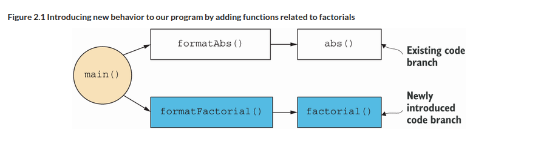

= 2 Getting started with functional programming in Kotlin
:toc:
:icons: font
:url-quickref: https://livebook.manning.com/book/functional-programming-in-kotlin/chapter-2/

{url-quickref}[See chapter online chapter].

== Higher order functions

> Functions are values

-> can be stored

-> passed as arguments

-> assigned to variables

== Functional loops: Recursion

State is kept on stack instead of heap

=== Factorial

IMPORTANT: xref:sec1/Listing1.kt[Factorial]

-> factorial(40) ?

-> factorial(100000) ?

[quote, tail call elimination]
____
A call is said to be in the tail position if the caller does nothing other than return the value of the recursive call.
____

=== Fibonacci

> Write a recursive function to get the nth Fibonacci number (https://www.britannica.com/science/Fibonacci-number). The first two Fibonacci numbers are 0 and 1. The nth number is always the sum of the previous two—the sequence begins 0, 1, 1, 2, 3, 5, 8, 13, 21. Your definition should use a local tail-recursive function.

IMPORTANT: xref:../../../test/kotlin/chapter2/exercises/ex1/listing.kt[]

== HOF Continued

> suppose we want to adapt our program to print out both the absolute value of a number and the factorial of another number

----
The absolute value of -42 is 42
The factorial of 7 is 5040
----

IMPORTANT: xref:sec1/Example.kt[]

== Polymorhpic functions

> *monomorphic* functions are functions that operate on only one type of data.

> Often, and especially when writing HOFs, we want to write code that works for any type it’s given. These are called *polymorphic* functions.

-> generics

Monomorphic:
[source, kotlin]
----
fun findFirst(ss: Array<String>, key: String): Int {
    tailrec fun loop(n: Int): Int =
        when {
            n >= ss.size -> -1
            ss[n] == key -> n
            else -> loop(n + 1)
        }
    return loop(0)
}
----

Polymorphic:
[source, kotlin]
----
fun <A> findFirst(xs: Array<A>, p: (A) -> Boolean): Int {
    tailrec fun loop(n: Int): Int =
        when {
            n >= xs.size -> -1
            p(xs[n]) -> n
            else -> loop(n + 1)
        }
    return loop(0)
}
----

> Implement `isSorted`, which checks whether a singly linked list `List<A>` is sorted according to a given comparison function. The function is preceded by two extension properties that add `head` and `tail` to any `List` value. The `head` property returns the first element of the list, while `tail` returns all subsequent elements as another `List<A>`

IMPORTANT: xref:../../../test/kotlin/chapter2/exercises/ex2/listing.kt[]

>  the possible implementations are significantly reduced when implementing a polymorphic function

.Runar Bjarnason:
> Constraints liberate, liberties constrain

=== Partial application

> This function, partial1, takes a value and a function with two arguments and returns a function with one argument as its result.

> If I can give you a carrot for an apple and a banana, and you already gave me an apple, you just have to give me a banana, and I’ll give you a carrot.

[source, kotlin]
----
fun <A, B, C> partial1(a: A, f: (A, B) -> C): (B) -> C = TODO()
----

IMPORTANT: xref:sec3/Listing1.kt[]

=== Currying

> converts a function f of two arguments into a function with one argument that partially applies f

> Currying is named after the mathematician Haskell Curry, who discovered the principle. It was independently discovered earlier by Moses Schönfinkel, but Schönfinkelization just didn’t catch on.

[source, kotlin]
----
fun <A, B, C> curry(f: (A, B) -> C): (A) -> (B) -> C = TODO()
----

IMPORTANT: xref:../../../test/kotlin/chapter2/exercises/ex3/listing.kt[]

=== Uncurry
[source, kotlin]
----
fun <A, B, C> uncurry(f: (A) -> (B) -> C): (A, B) -> C = TODO()
----

IMPORTANT: xref:../../../test/kotlin/chapter2/exercises/ex4/listing.kt[]

=== Function composition

> feeds the output of one function to the input of another function.

[source, kotlin]
----
fun <A, B, C> compose(f: (B) -> C, g: (A) -> B): (A) -> C = TODO()
----
IMPORTANT: xref:../../../test/kotlin/chapter2/exercises/ex5/listing.kt[]
