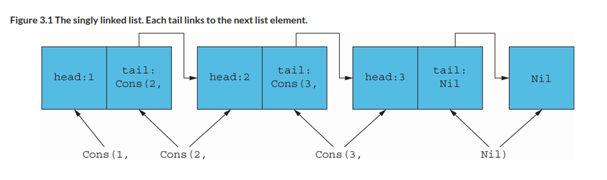
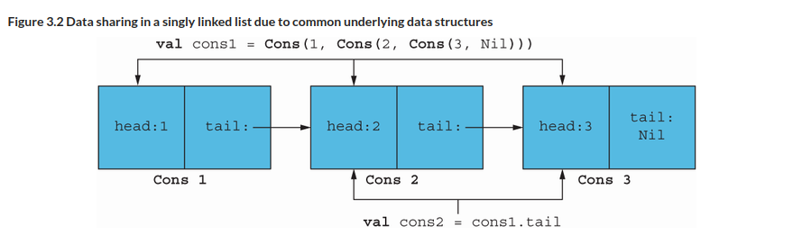

= 3 Functional data structures
:toc:
:icons: font
:url-quickref: https://livebook.manning.com/book/functional-programming-in-kotlin/chapter-3/

{url-quickref}[See chapter online chapter].

== Functional data structures

> A functional data structure is operated on using only pure functions.

-> immutable

-> veel data copy?

=== Singly linked list

[source, kotlin]
----
sealed class List<out A>

object Nil : List<Nothing>()

data class Cons<out A>(val head: A, val tail: List<A>) : List<A>()
----

[%collapsible]
====

-> cons == construct

-> polymorhpic data structure

-> `out A` <- covariant: List<Dog> is subtype of List<Animal>

> for all types X and Y, if X is a subtype of Y, then List<X> is a subtype of List<Y>

-> `Nothing` is a subtype of all types
====

[source, kotlin]
----
val ex1: List<Double> = Nil
val ex2: List<Int> = Cons(1, Nil)
val ex3: List<String> = Cons("a", Cons("b", Nil))
----

==== Creating a list:

[source, kotlin]
----
sealed class List<out A> {

    companion object {

        fun <A> of(vararg aa: A): List<A> {
            val tail = aa.sliceArray(1 until aa.size)
            return if (aa.isEmpty()) Nil else Cons(aa[0], of(*tail))
        }

    }
}
----

[%collapsible]
====

[source, kotlin]
----
>>> List.of(1, 2)
res0: chapter3.List<kotlin.Int> = Cons(head=1, tail=Cons(head=2, tail=Nil))
----

====

==== Pattern matching

[source, kotlin]
----
fun sum(ints: List<Int>): Int =
    when (ints) {
        is Nil -> 0
        is Cons -> ints.head + sum(ints.tail)
    }
----

[%collapsible]
====
Wishlist: destructuring in pattern matching:
[source]
----
fun sum(xs: List): Int = when(xs) {
    case Nil -> 0
    case Cons(head, tail) -> head + sum(tail)
}
----

->
====

==== Data sharing

-> add element in beginning of list: `Cons(x, xs)`

-> remove element from beginning of list: `xs.tail`

-> No need for pessimistic copying

==== tail

> Implement the function tail for removing the first element of a List.

[source, kotlin]
----
fun <A> tail(xs: List<A>): List<A> = TODO()
----
IMPORTANT: xref:../../../test/kotlin/chapter3/exercises/ex1/listing.kt[]

==== setHead

> Implement the function setHead for replacing the first element of a List with a different value.

[source, kotlin]
----
fun <A> setHead(xs: List<A>, x: A): List<A> = TODO()
----
IMPORTANT: xref:../../../test/kotlin/chapter3/exercises/ex2/listing.kt[]

==== drop

> Generalize tail to the function drop, which removes the first n elements from a list.

[source, kotlin]
----
fun <A> drop(l: List<A>, n: Int): List<A> = TODO()
----
IMPORTANT: xref:../../../test/kotlin/chapter3/exercises/ex3/listing.kt[]

> Implement dropWhile, which removes elements from the List prefix as long as they match a predicate.

[source, kotlin]
----
fun <A> dropWhile(l: List<A>, f: (A) -> Boolean): List<A> = TODO()
----
IMPORTANT: xref:../../../test/kotlin/chapter3/exercises/ex4/listing.kt[]

==== append

[source, kotlin]
----
fun <A> append(a1: List<A>, a2: List<A>): List<A> =
    when (a1) {
        is Nil -> a2
        is Cons -> Cons(a1.head, append(a1.tail, a2))
    }
----

-> run time and memory usage are determined only by the length of `a1`

==== init

> Implement a function, init, that returns a List consisting of all but the last element of a List

[source, kotlin]
----
fun <A> init(l: List<A>): List<A> = TODO()
----
IMPORTANT: xref:../../../test/kotlin/chapter3/exercises/ex4/listing.kt[]

-> costly

==== Foldright

[source, kotlin]
----
fun sum(xs: List<Int>): Int = when (xs) {
    is Nil -> 0
    is Cons -> xs.head + sum(xs.tail)
}

fun product(xs: List<Double>): Double = when (xs) {
    is Nil -> 1.0
    is Cons -> xs.head * product(xs.tail)
}
----

[%collapsible]
====

Similarities:

[source, kotlin]
----
fun <A, B> foldRight(xs: List<A>, z: B, f: (A, B) -> B): B =
    when (xs) {
        is Nil -> z
        is Cons -> f(xs.head, foldRight(xs.tail, z, f))
    }

fun sum2(ints: List<Int>): Int =
    foldRight(ints, 0, { a, b -> a + b })

fun product2(dbs: List<Double>): Double =
    foldRight(dbs, 1.0, { a, b -> a * b })
----

[source]
----
Cons(1, Cons(2, Nil))
f   (1, f   (2, z  ))
----

[source, kotlin]
----
foldRight(Cons(1, Cons(2, Cons(3, Nil))), 0, { x, y -> x + y })
1 + foldRight(Cons(2, Cons(3, Nil)), 0, { x, y -> x + y })
1 + (2 + foldRight(Cons(3, Nil), 0, { x, y -> x + y }))
1 + (2 + (3 + (foldRight(Nil as List<Int>, 0, { x, y -> x + y }))))
1 + (2 + (3 + (0)))
6
----

> `foldRight` must traverse all the way to the end of the list (pushing frames onto the call stack as it goes) before it can begin collapsing by applying the anonymous function.

> Can product, implemented using foldRight, immediately halt the recursion and return 0.0 if it encounters a 0.0?

====

