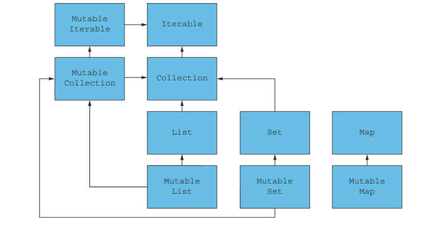

= 3 Functional data structures
:toc:
:icons: font
:url-quickref: https://livebook.manning.com/book/functional-programming-in-kotlin/chapter-3/

{url-quickref}[See chapter online chapter].

== Functional data structures

> A functional data structure is operated on using only pure functions.

-> immutable

-> veel data copy?

== Singly linked list

[source, kotlin]
----
sealed class List<out A>

object Nil : List<Nothing>()

data class Cons<out A>(val head: A, val tail: List<A>) : List<A>()
----

image::image-2024-03-17-11-17-00-350.png[]

[%collapsible]
====

-> cons == construct

-> polymorhpic data structure

-> `out A` <- covariant: List<Dog> is subtype of List<Animal>

> for all types X and Y, if X is a subtype of Y, then List<X> is a subtype of List<Y>

-> `Nothing` is a subtype of all types
====

[source, kotlin]
----
val ex1: List<Double> = Nil
val ex2: List<Int> = Cons(1, Nil)
val ex3: List<String> = Cons("a", Cons("b", Nil))
----

=== Creating a list:

[source, kotlin]
----
sealed class List<out A> {

    companion object {

        fun <A> of(vararg aa: A): List<A> {
            val tail = aa.sliceArray(1 until aa.size)
            return if (aa.isEmpty()) Nil else Cons(aa[0], of(*tail))
        }

        fun <A> empty(): List<A> = Nil

    }
}
----

[%collapsible]
====

[source, kotlin]
----
>>> List.of(1, 2)
res0: chapter3.List<kotlin.Int> = Cons(head=1, tail=Cons(head=2, tail=Nil))
----

====

=== Pattern matching

[source, kotlin]
----
fun sum(ints: List<Int>): Int =
    when (ints) {
        is Nil -> 0
        is Cons -> ints.head + sum(ints.tail)
    }
----

[%collapsible]
====
Wishlist: destructuring in pattern matching:
[source]
----
fun sum(xs: List): Int = when(xs) {
    case Nil -> 0
    case Cons(head, tail) -> head + sum(tail)
}
----

====

=== Data sharing

-> add element in beginning of list: `Cons(x, xs)`

-> remove element from beginning of list: `xs.tail`

-> No need for pessimistic copying

image::image-2024-03-17-11-52-07-633.png[]

==== tail

> Implement the function tail for removing the first element of a List.

[source, kotlin]
----
fun <A> tail(xs: List<A>): List<A> = TODO()
----

IMPORTANT: xref:../../../test/kotlin/chapter3/exercises/ex1/listing.kt[]

==== setHead

> Implement the function setHead for replacing the first element of a List with a different value.

[source, kotlin]
----
fun <A> setHead(xs: List<A>, x: A): List<A> = TODO()
----
IMPORTANT: xref:../../../test/kotlin/chapter3/exercises/ex2/listing.kt[]

==== drop

> Generalize tail to the function drop, which removes the first n elements from a list.

[source, kotlin]
----
fun <A> drop(l: List<A>, n: Int): List<A> = TODO()
----
IMPORTANT: xref:../../../test/kotlin/chapter3/exercises/ex3/listing.kt[]

> Implement dropWhile, which removes elements from the List prefix as long as they match a predicate.

[source, kotlin]
----
fun <A> dropWhile(l: List<A>, f: (A) -> Boolean): List<A> = TODO()
----
IMPORTANT: xref:../../../test/kotlin/chapter3/exercises/ex4/listing.kt[]

==== append

[source, kotlin]
----
fun <A> append(a1: List<A>, a2: List<A>): List<A> =
    when (a1) {
        is Nil -> a2
        is Cons -> Cons(a1.head, append(a1.tail, a2))
    }
----

-> run time and memory usage are determined only by the length of `a1`

==== init

> Implement a function, init, that returns a List consisting of all but the last element of a List

[source, kotlin]
----
fun <A> init(l: List<A>): List<A> = TODO()
----
IMPORTANT: xref:../../../test/kotlin/chapter3/exercises/ex4/listing.kt[]

-> costly

=== Foldright

[source, kotlin]
----
fun sum(xs: List<Int>): Int = when (xs) {
    is Nil -> 0
    is Cons -> xs.head + sum(xs.tail)
}

fun product(xs: List<Double>): Double = when (xs) {
    is Nil -> 1.0
    is Cons -> xs.head * product(xs.tail)
}

// fun product(doubles: List<Double>): Double =
//     when (doubles) {
//         is Nil -> 1.0
//         is Cons ->
//             if (doubles.head == 0.0) 0.0
//             else doubles.head * product(doubles.tail)
// }
----

[%collapsible]
====

Similarities:

[source, kotlin]
----
fun <A, B> foldRight(xs: List<A>, z: B, f: (A, B) -> B): B =
    when (xs) {
        is Nil -> z
        is Cons -> f(xs.head, foldRight(xs.tail, z, f))
    }

fun sum2(ints: List<Int>): Int =
    foldRight(ints, 0, { a, b -> a + b })

fun product2(dbs: List<Double>): Double =
    foldRight(dbs, 1.0, { a, b -> a * b })
----

[source, kotlin]
----
foldRight(Cons(1, Cons(2, Cons(3, Nil))), 0, { x, y -> x + y })
1 + foldRight(Cons(2, Cons(3, Nil)), 0, { x, y -> x + y })
1 + (2 + foldRight(Cons(3, Nil), 0, { x, y -> x + y }))
1 + (2 + (3 + (foldRight(Nil as List<Int>, 0, { x, y -> x + y }))))
1 + (2 + (3 + (0)))
6
----

> `foldRight` must traverse all the way to the end of the list (pushing frames onto the call stack as it goes) before it can begin collapsing by applying the anonymous function.

> Can product, implemented using foldRight, immediately halt the recursion and return 0.0 if it encounters a 0.0?

====

==== Foldright resembles List:

> See what happens when you pass Nil and Cons to foldRight:

[source]
----
Cons(1, Cons(2, Nil))
f   (1, f   (2, z  ))
----

[source, kotlin]
----
foldRight(
    Cons(1, Cons(2, Cons(3, Nil))),
    Nil as List<Int>,
    { x, y -> Cons(x, y) }
)
----

[%collapsible]
====
[source, kotlin]
----
foldRight(List.of(1, 2, 3), z, f)
Cons(1, foldRight(List.of(2, 3), z, f))
Cons(1, Cons(2, foldRight(List.of(3), z, f)))
Cons(1, Cons(2, Cons(3, foldRight(List.empty(), z, f))))
Cons(1, Cons(2, Cons(3, Nil)))
----
====

==== length

> Compute the length of a list using foldRight.

[source, kotlin]
----
fun <A> length(xs: List<A>): Int = TODO()
----
IMPORTANT: xref:../../../test/kotlin/chapter3/exercises/ex8/listing.kt[]

=== Foldleft

> Our implementation of foldRight is not tail-recursive and will result in a StackOverflowError for large lists. Write another general list-recursion function, foldLeft, that is tail-recursive

[source, kotlin]
----
tailrec fun <A, B> foldLeft(xs: List<A>, z: B, f: (B, A) -> B): B = TODO()
----
IMPORTANT: xref:../../../test/kotlin/chapter3/exercises/ex9/listing.kt[]

==== Sum, product, length

> Write sum, product, and a function to compute the length of a list using foldLeft.

IMPORTANT: xref:../../../test/kotlin/chapter3/exercises/ex10/listing.kt[]

==== Reverse

> Write a function that returns the reverse of a list (given List(1,2,3), it returns List(3,2,1)). See if you can write it using a fold.

IMPORTANT: xref:../../../test/kotlin/chapter3/exercises/ex11/listing.kt[]

==== Foldright in terms of foldleft

> Can you write foldLeft in terms of foldRight? How about the other way around? Implementing foldRight via foldLeft is useful because it lets us implement foldRight tail-recursively, which means it works even for large lists without overflowing the stack.

IMPORTANT: xref:../../../test/kotlin/chapter3/exercises/ex12/listing.kt[]

> It is certainly possible to do both directions. For foldLeft in terms of foldRight, you should build up, using foldRight, some value that you can use to achieve the effect of foldLeft. This won’t necessarily be the B of the return type but could be a function of signature (B) -> B, also known as Identity in category theory.

WARNING: xref:../../../test/kotlin/chapter3/solutions/ex12/listing.kt[]

==== Append

> Implement append in terms of either foldLeft or foldRight.

IMPORTANT: xref:../../../test/kotlin/chapter3/exercises/ex13/listing.kt[]

==== Concat

> Write a function that concatenates a list of lists into a single list. Its runtime should be linear in the total length of all lists. Try to use functions we have already defined.

IMPORTANT: xref:../../../test/kotlin/chapter3/exercises/ex14/listing.kt[]

==== +1

> Write a function that transforms a list of integers by adding 1 to each element. This should be a pure function that returns a new List.

IMPORTANT: xref:../../../test/kotlin/chapter3/exercises/ex15/listing.kt[]

==== Double to string

> Write a function that turns each value in a List<Double> into a String. You can use the expression d.toString() to convert some d: Double to a String.

IMPORTANT: xref:../../../test/kotlin/chapter3/exercises/ex16/listing.kt[]

=== map

> Write a function map that generalizes modifying each element in a list while maintaining the structure of the list.

[source, kotlin]
----
fun <A, B> map(xs: List<A>, f: (A) -> B): List<B> = TODO()
----
IMPORTANT: xref:../../../test/kotlin/chapter3/exercises/ex17/listing.kt[]

=== filter

> Write a function filter that removes elements from a list unless they satisfy a given predicate.

[source, kotlin]
----
fun <A> filter(xs: List<A>, f: (A) -> Boolean): List<A> = TODO()
----
IMPORTANT: xref:../../../test/kotlin/chapter3/exercises/ex18/listing.kt[]

=== flatmap

> Write a function flatMap that works like map except that the function given will return a list instead of a single result, and that list should be inserted into the final resulting list.

[source, kotlin]
----
fun <A, B> flatMap(xa: List<A>, f: (A) -> List<B>): List<B> = TODO()
----

For instance, `flatMap(List.of(1, 2, 3), { i -> List.of(i, i) })` should result in `List(1, 1, 2, 2, 3, 3)`.

IMPORTANT: xref:../../../test/kotlin/chapter3/exercises/ex19/listing.kt[]

==== filter by flatmap

> Use flatMap to implement filter.

IMPORTANT: xref:../../../test/kotlin/chapter3/exercises/ex20/listing.kt[]

=== zipWith

> Write a function that accepts two lists and constructs a new list by adding corresponding elements. For example, List(1,2,3) and List(4,5,6) become List(5,7,9).

IMPORTANT: xref:../../../test/kotlin/chapter3/exercises/ex21/listing.kt[]

> Generalize the function you just wrote so that it’s not specific to integers or addition. Name your generalized function zipWith.

IMPORTANT: xref:../../../test/kotlin/chapter3/exercises/ex22/listing.kt[]

=== Kotlin list

Immutable vs read-only (`java.util.ArrayList`)

=== Contains

> Implement hasSubsequence to check whether a List contains another List as a subsequence. For instance, List(1,2,3,4) would have List(1,2), List(2,3), and List(4) as subsequences, among others.

[source, kotlin]
----
tailrec fun <A> hasSubsequence(xs: List<A>, sub: List<A>): Boolean = TODO()
----
IMPORTANT: xref:../../../test/kotlin/chapter3/exercises/ex23/listing.kt[]

== Trees

[source, kotlin]
----
sealed class Tree<out A>

data class Leaf<A>(val value: A) : Tree<A>()

data class Branch<A>(val left: Tree<A>, val right: Tree<A>) : Tree<A>()
----

=== ADT (algebraic data types)

> An ADT is just a data type defined by one or more data constructors, each of which may contain zero or more arguments.

> We say that the data type is the sum or union of its data constructors, and each data constructor is the product of its arguments—hence the name algebraic data type.

=== FP and encapsulation

-> there is none

=== Size

> Write a function size that counts the number of nodes (leaves and branches) in a tree.

IMPORTANT: xref:../../../test/kotlin/chapter3/exercises/ex24/listing.kt[]

=== Max

> Write a function maximum that returns the maximum element in a Tree<Int>.

IMPORTANT: xref:../../../test/kotlin/chapter3/exercises/ex25/listing.kt[]

=== Depth

> Write a function depth that returns the maximum path length from the root of a tree to any leaf.

IMPORTANT: xref:../../../test/kotlin/chapter3/exercises/ex26/listing.kt[]

=== map

> Write a function map, analogous to the method of the same name on List, that modifies each element in a tree with a given function.

IMPORTANT: xref:../../../test/kotlin/chapter3/exercises/ex27/listing.kt[]

=== fold

> Generalize size, maximum, depth, and map for Tree, writing a new function fold that abstracts over their similarities. Reimplement them in terms of this more general function. Can you draw an analogy between this fold function and the left and right folds for List?

[source, kotlin]
----
fun <A, B> fold(ta: Tree<A>, l: (A) -> B, b: (B, B) -> B): B = TODO()

fun <A> sizeF(ta: Tree<A>): Int = TODO()
fun maximumF(ta: Tree<Int>): Int = TODO()
fun <A> depthF(ta: Tree<A>): Int = TODO()
fun <A, B> mapF(ta: Tree<A>, f: (A) -> B): Tree<B> = TODO()
----
IMPORTANT: xref:../../../test/kotlin/chapter3/exercises/ex28/listing.kt[]

