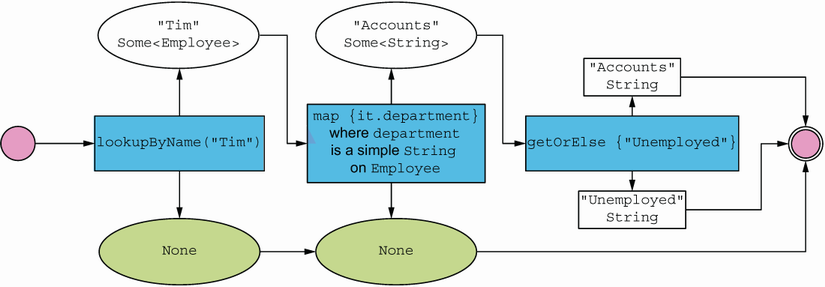
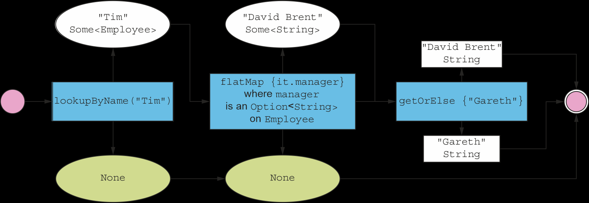
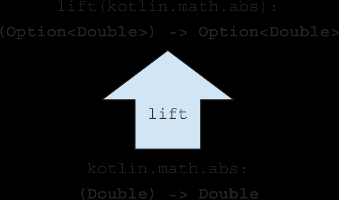

= 4 Handling errors without exceptions
:toc:
:icons: font
:url-quickref: https://livebook.manning.com/book/functional-programming-in-kotlin/chapter-4/

{url-quickref}[See chapter online chapter].

== The problems with throwing exceptions

Loss of control

> At the point that an exception is thrown, control is delegated away from the program, and the exception is propagated up the call stack.

> the meaning of an RT expression *does not depend* on context and may be reasoned about locally, whereas the meaning of a non-RT expression is *context dependent* and requires more global reasoning

=== Downsides of exceptions

* Exceptions break RT and introduce context dependence
** Dont' throw excpetions for control flow
** FP: only when we cannot recover
* Exceptions are not type-safe
** (int) -> int

=== Advantage of exception

Consolidate and centralize error-handling logic

== Problematic alternatives to exceptions

[source, kotlin]
----
fun mean(xs: List<Double>): Double =
    if (xs.isEmpty())
        throw ArithmeticException("mean of empty list!")
    else xs.sum() / length(xs)
----

-> _##partial function##_: it’s not defined for some inputs

> A function is typically partial because it makes some assumptions about its inputs that aren’t implied by the input types

=== Sentinel value

> return some sort of bogus value of type Double

Possibilities:

* Double.NaN
* null
* -99,99

Problems:

* It allows errors to silently propagate
* Boilerplate code at call sites (if statements)
* Does not apply to polymorphic code (vb: A)
* Demands a particular calling convention of callers (compiler does not help)

=== Supplied default value

[source, kotlin]
----
fun mean(xs: List<Double>, onEmpty: Double) =
    if (xs.isEmpty()) onEmpty
    else xs.sum() / xs.size()
----

-> total function (taking each value of the input type into precisely one value of the output type)

Problems:

* Immediate callers have direct knowledge of how to handle the undefined case
* What if mean is called as part of a more extensive computation, and we’d like to abort that computation if mean is undefined?

== Encoding success conditions with Option

> representing that a function may not always have an answer in the return type

> deferring the error-handling strategy to the caller

[source, kotlin]
----
sealed class Option<out A>

data class Some<out A>(val get: A) : Option<A>()

object None : Option<Nothing>()
----

Mean:

[source, kotlin]
----
fun mean(xs: List<Double>): Option<Double> =
    if (xs.isEmpty()) None
    else Some(xs.sum() / xs.size())
----

[%collapsible]
====

Kotlin: Nullable types, and how they compare to Option

> The type system differentiates between references that could hold a null and those that can never do so.

`String` vs `String?`

====

=== Option as a type of List

> Option can be thought of like a List that can contain at most one element

[source, kotlin]
----
fun <A, B> Option<A>.map(f: (A) -> B): Option<B> =

fun <A, B> Option<A>.flatMap(f: (A) -> Option<B>): Option<B> =

fun <A> Option<A>.getOrElse(default: () -> A): A =

fun <A> Option<A>.orElse(ob: () -> Option<A>): Option<A> =

fun <A> Option<A>.filter(f: (A) -> Boolean): Option<A> =
----

IMPORTANT: xref:../../../test/kotlin/chapter4/exercises/ex1/listing.kt[]

=== Usage patterns

> Although we can explicitly match on an Option, we’ll almost always use the previous HOFs.

==== map

[source, kotlin]
----
data class Employee(
    val name: String,
    val department: String,
    val manager: Option<String>
)

fun lookupByName(name: String): Option<Employee> = TODO()

fun timDepartment(): Option<String> =
    lookupByName("Tim").map { it.department }
----

-> deferring error handling to later code

==== flatmap

-> Getting the manager:

[source, kotlin]
----
val unwieldy: Option<Option<String>> =
    lookupByName("Tim").map { it.manager }
----

Try again:

[source, kotlin]
----
val manager: String = lookupByName("Tim")
    .flatMap { it.manager }
    .getOrElse { "Unemployed" }
----

===== Variance

> Implement the `variance` function in terms of flatMap. If the mean of a sequence is `m`, the variance is the mean of `x` minus `m` to the power of `2` for each element of `x` in the sequence. In code, this is `(x - m).pow(2)`.

IMPORTANT: xref:../../../test/kotlin/chapter4/exercises/ex2/listing.kt[]

> with flatMap we can construct a computation with multiple stages, any of which may fail. The computation will abort as soon as the first failure is encountered since `None.flatMap(f)` will immediately return `None`, without running `f`.

==== filter

> We can use filter to convert successes into failures if the successful values don’t match the predicate

[source, kotlin]
----
val dept: String = lookupByName("Tim")
    .map { it.department }
    .filter { it != "Accounts" }
    .getOrElse { "Unemployed" }
----

> A common idiom is to do o.getOrElse(throw Exception("FAIL")) to convert the None case of an Option back to an exception. The general rule of thumb is that we use exceptions only if no reasonable program would ever catch the exception

=== Option composition, lifting, and wrapping exception-oriented APIs

> It may be easy to jump to the conclusion that once we start using Option, it infects our entire code base

==== Lift

>  we can lift ordinary functions to become functions that operate on Option

> The map function turns a function f of type `(A) -> B` into a function of type `(Option<A>) -> Option<B>`

[source, kotlin]
----
fun <A, B> lift(f: (A) -> B): (Option<A>) -> Option<B> =
    { oa -> oa.map(f) }
----

> any function we already have lying around can be transformed (via lift) to operate within the context of a single Option value

[source, kotlin]
----
val absO: (Option<Double>) -> Option<Double> =
    lift { kotlin.math.abs(it) }
----

==== Catches

[source, kotlin]
----
>>> "112".toInt()
res0: kotlin.Int = 112

>>> "hello".toInt()
java.lang.NumberFormatException: For input string: "hello"
----

[source, kotlin]
----
fun <A> catches(a: () -> A): Option<A> =
    try {
        Some(a())
    } catch (e: Throwable) {
        None
    }
----

-> lazy argument

> convert from an exception-based API to an Option-oriented API

[source, kotlin]
----
val optAge: Option<Int> = catches { age.toInt() }
----

==== Insurance example

[source, kotlin]
----
/**
 * Top secret formula for computing an annual car
 * insurance premium from two key factors.
 */
fun insuranceRateQuote(
    age: Int,
    numberOfSpeedingTickets: Int
): Double = TODO()
----

-> input komt van web form via strings

[source, kotlin]
----
fun parseInsuranceRateQuote(
    age: String,
    speedingTickets: String
): Option<Double> {

    val optAge: Option<Int> = catches { age.toInt() }

    val optTickets: Option<Int> =
        catches { speedingTickets.toInt() }

    //return insuranceRateQuote(optAge, optTickets)
}
----

> we’d like to lift insuranceRateQuote to operate in the context of two optional values

==== map2

> Write a generic function, map2, that combines two Option values using a binary function. If either Option value is None, the return value is, too

[source, kotlin]
----
fun <A, B, C> map2(a: Option<A>, b: Option<B>, f: (A, B) -> C): Option<C> =

----

IMPORTANT: xref:../../../test/kotlin/chapter4/exercises/ex3/listing.kt[]

[source, kotlin]
----
fun parseInsuranceRateQuote(
    age: String,
    speedingTickets: String
): Option<Double> {
    val optAge: Option<Int> = catches { age.toInt() }

    val optTickets: Option<Int> = catches { speedingTickets.toInt() }

    return map2(optAge, optTickets) { a, t ->
        insuranceRateQuote(a, t)
    }
}
----

-> drawback: if either or both of the Options are None, an overall None is returned, so we lose the knowledge of which has failed.

-> Can you already see how you might define map3, map4, and map5?

==== Sequence

> Write a function, sequence, that combines a list of Options into one Option containing a list of all the Some values in the original list. If the original list contains None even once, the result of the function should be None; otherwise, the result should be Some with a list of all the values

IMPORTANT: xref:../../../test/kotlin/chapter4/exercises/ex4/listing.kt[]

==== Traverse

> what if we have a whole list of String values that we wish to parse to Option<Int>

[source, kotlin]
----
fun parseInts(xs: List<String>): Option<List<Int>> =
    sequence(xs.map { str -> catches { str.toInt() } })
----

-> inefficient since it traverses the list twice

> Implement the traverse function. It’s fairly straightforward to do using map and sequence, but try for a more efficient implementation that only looks at the list once. When complete, implement sequence by using traverse.

[source, kotlin]
----
fun <A, B> traverse(
    xa: List<A>,
    f: (A) -> Option<B>
): Option<List<B>> =
----

IMPORTANT: xref:../../../test/kotlin/chapter4/exercises/ex5/listing.kt[]

=== For-comprehensions with Option

>  A construct that applies syntactic sugar over a series of flatMap and map calls, yielding a final result.

For map2:

[source, kotlin]
----
fun <A, B, C> map2(
    oa: Option<A>,
    ob: Option<B>,
    f: (A, B) -> C
): Option<C> =
    oa.flatMap { a ->
        ob.map { b ->
            f(a, b)
        }
    }
----

>> Arrow.fx

[source, kotlin]
----
fun <A, B, C> map2(
    oa: Option<A>,
    ob: Option<B>,
    f: (A, B) -> C
): Option<C> =
    Option.fx {
        val a = oa.bind()
        val b = ob.bind()
        f(a, b)
    }
----

== Encoding success and failure conditions with Either

> Option doesn’t tell us anything about what went wrong in the case of an exceptional condition.

[source, kotlin]
----
sealed class Either<out E, out A>

data class Left<out E>(val value: E) : Either<E, Nothing>()

data class Right<out A>(val value: A) : Either<Nothing, A>()
----

> `Either` represents values that can be one of two things

> It’s a disjoint union of two types

> When we use it to indicate success or failure, by convention, the Right constructor is reserved for the success case (a pun on “right,” meaning correct), and Left is used for failure

=== Mean

[source, kotlin]
----
fun mean(xs: List<Double>): Either<String, Double> =
    if (xs.isEmpty())
        Left("mean of empty list!")
    else Right(xs.sum() / xs.size())
----

=== Div

[source, kotlin]
----
fun safeDiv(x: Int, y: Int): Either<Exception, Int> =
    try {
        Right(x / y)
    } catch (e: Exception) {
        Left(e)
    }
----

=== Catches

[source, kotlin]
----
fun <A> catches(a: () -> A): Either<Exception, A> =
    try {
        Right(a())
    } catch (e: Exception) {
        Left(e)
    }
----

=== map, flatmap, etc

[source, kotlin]
----
fun <E, A, B> Either<E, A>.map(f: (A) -> B): Either<E, B> =

fun <E, A, B> Either<E, A>.flatMap(f: (A) -> Either<E, B>): Either<E, B> =

fun <E, A> Either<E, A>.orElse(f: () -> Either<E, A>): Either<E, A> =

fun <E, A, B, C> map2(
    ae: Either<E, A>,
    be: Either<E, B>,
    f: (A, B) -> C
): Either<E, C> =

----

IMPORTANT: xref:../../../test/kotlin/chapter4/exercises/ex6/listing.kt[]

=== For-comprehensions with Either

-> Arrow

[source, kotlin]
----
suspend fun String.parseToInt(): arrow.core.Either<Throwable, Int> =
    arrow.core.Either.catch { this.toInt() }

suspend fun parseInsuranceRateQuote(
    age: String,
    numberOfSpeedingTickets: String
): arrow.core.Either<Throwable, Double> {
    val ae = age.parseToInt()
    val te = numberOfSpeedingTickets.parseToInt()
    return arrow.core.Either.fx {
        val a = ae.bind()
        val t = te.bind()
        insuranceRateQuote(a, t)
    }
}
----

-> suspend want mogelijks blocking operation

> if either or both instances are Either.Left<Throwable>, the first will be returned to the method’s caller, short-circuiting the rest of the for-comprehension. The right side of the Either always takes precedence, so it is said to be right-biased.

=== Sequence & traverse

> Implement sequence and traverse for Either. These should return the first error that’s encountered, if there is one.

IMPORTANT: xref:../../../test/kotlin/chapter4/exercises/ex7/listing.kt[]

=== mkPerson

[source, kotlin]
----
data class Name(val value: String)
data class Age(val value: Int)
data class Person(val name: Name, val age: Age)

fun mkName(name: String): Either<String, Name> =
    if (name.isBlank()) Left("Name is empty.")
    else Right(Name(name))

fun mkAge(age: Int): Either<String, Age> =
    if (age < 0) Left("Age is out of range.")
    else Right(Age(age))

fun mkPerson(name: String, age: Int): Either<String, Person> =
    map2(mkName(name), mkAge(age)) { n, a -> Person(n, a) }
----

> map2 can report only one error, even if both the name and age are invalid. What would you need to change to report both errors? Would you change map2 or the signature of mkPerson? Or could you create a new data type that captures this requirement better than Either does, with some additional structure? How would orElse, traverse, and sequence behave differently for that data type?

[%collapsible]
====

IMPORTANT: xref:../../../test/kotlin/chapter4/solutions/ex8/listing.kt[]

> There are a number of variations on Option and Either. If you want to accumulate multiple errors, a simple approach is a new data type that lets you keep a list of errors in the data constructor that represents failures.

> There is a very similar type called Validated in the Arrow library. You can implement map, map2, sequence, and so on for this type in such a way that errors are accumulated when possible (flatMap is unable to accumulate errors—can you see why?).

> This idea can even be generalized further: you don’t need to accumulate failing values into a list; you can accumulate values using any user-supplied binary function. It’s also possible to use Either<List<E>,_> directly to accumulate errors, using different implementations of helper functions like map2 and sequence.

====
