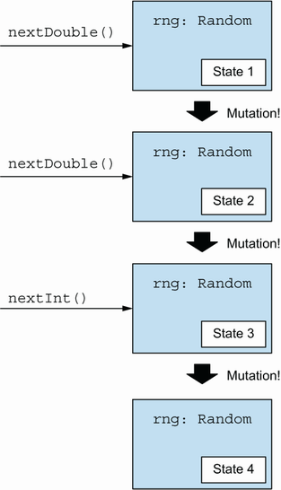

= 6 Purely functional state
:toc:
:icons: font
:url-quickref: https://livebook.manning.com/book/functional-programming-in-kotlin/chapter-6/

{url-quickref}[See chapter online chapter].

FP:

* immutability
* eradicating side effects

Mutating state comes at a considerable cost, making programs difficult to reason about and maintain

By viewing the program state as a transition or action that is passed along as context during a series of transformations, we can contain and localize the complexity associated with state machines.

+ *hiding* these state transitions through the use of higher-order combinators

== 6.1 Generating random numbers using side effects

=== imperative solution

[source, kotlin]
----
>>> val rng = kotlin.random.Random

>>> rng.nextDouble()
res1: kotlin.Double = 0.2837830961138915

>>> rng.nextDouble()
res2: kotlin.Double = 0.7994579111535903

>>> rng.nextInt()
res3: kotlin.Int = -1630636086

>>> rng.nextInt(10)
res4: kotlin.Int = 8
----

-> object rng has some internal state that is updated after each invocation

-> not referentially transparent

-> not testable, composable, modular, ...

=== Roll die

[source, kotlin]
----
fun rollDie(): Int {
    val rng = kotlin.random.Random
    return rng.nextInt(6)
}
----

-> off-by-one error (6)

Beter maar nog steeds met side-effects en niet testbaar:

[source, kotlin]
----
fun rollDie2(rng: kotlin.random.Random): Int = rng.nextInt(6)
----

== 6.2 Purely functional random number generation

> making the state updates explicit.

[source, kotlin]
----
interface RNG {
    fun nextInt(): Pair<Int, RNG>
}
----

> we return the random number and the new state. We leave the old state unmodified. In effect, we separate the concern of computing what the next state is from communicating the new state to the rest of the program

> Note that we’re still encapsulating the state in the sense that users of this API don’t know anything about the implementation of the random number generator itself.

=== Linear congruential generator

[source, kotlin]
----
data class SimpleRNG(val seed: Long) : RNG {
    override fun nextInt(): Pair<Int, RNG> {
        val newSeed =
            (seed * 0x5DEECE66DL + 0xBL) and
                0xFFFFFFFFFFFFL
        val nextRNG = SimpleRNG(newSeed)
        val n = (newSeed ushr 16).toInt()
        return n to nextRNG
    }
}
----

[source, kotlin]
----
>>> val rng = SimpleRNG(42)

>>> val (n1, rng2) = rng.nextInt()

>>> println("n1:$n1; rng2:$rng2")

n1:16159453; rng2:SimpleRNG(seed=1059025964525)

>>> val (n2, rng3) = rng2.nextInt()

>>> println("n2:$n2; rng3:$rng3")

n2:-1281479697; rng3:SimpleRNG(seed=197491923327988)
----

-> pure function

== 6.3 Making stateful APIs pure

[source, kotlin]
----
class MutatingSequencer {
    private var repo: Repository = TODO()
    fun nextInt(): Int = TODO()
    fun nextDouble(): Double = TODO()
}
----

Now suppose nextInt and nextDouble each mutate repo in some way. We can mechanically translate this interface to a purely functional one by making the state transition explicit:

[source, kotlin]
----
interface StateActionSequencer {
    fun nextInt(): Pair<Int, StateActionSequencer>
    fun nextDouble(): Pair<Double, StateActionSequencer>
}
----

-> we make the caller responsible for passing the next computed state

[source, kotlin]
----
fun randomPair(rng: RNG): Pair<Int, Int> {
    val (i1, _) = rng.nextInt()
    val (i2, _) = rng.nextInt()
    return i1 to i2
}
----

-> `i1` and `i2` are always the same

[source, kotlin]
----
fun randomPair2(rng: RNG): Pair<Pair<Int, Int>, RNG> {
    val (i1, rng2) = rng.nextInt()
    val (i2, rng3) = rng2.nextInt()
    return (i1 to i2) to rng3
}
----

-> `i1` and `i2` are different

==== Non negative numbers
Write a function that uses RNG.nextInt to generate a random integer between 0 and Int.MAX_VALUE (inclusive).

NOTE: Here’s a tip: each negative value must be mapped to a distinct non-negative value. Make sure to handle the corner case when nextInt returns Int.MIN_VALUE, which doesn’t have a non-negative counterpart.

[source, kotlin]
----
fun nonNegativeInt(rng: RNG): Pair<Int, RNG> =
----

IMPORTANT: xref:../../../test/kotlin/chapter6/exercises/ex1/listing.kt[]

    Dealing with awkwardness in functional programming
    As you write more functional programs, you’ll sometimes encounter situations where the functional way of expressing a program feels awkward or tedious. ... Awkwardness like this is almost always a sign of some missing abstraction waiting to be discovered.

==== Double

Write a function to generate a Double between 0 and 1, not including 1. In addition to the function you already developed, you can use Int.MAX_VALUE to obtain the maximum positive integer value, and you can use x.toDouble() to convert an x: Int to a Double.

[source, kotlin]
----
fun double(rng: RNG): Pair<Double, RNG> =
----

IMPORTANT: xref:../../../test/kotlin/chapter6/exercises/ex2/listing.kt[]

==== Pairs

Write functions to generate a `Pair<Int, Double>`, a `Pair<Double, Int>`, and a `Triple <Double, Double, Double>`. You should be able to reuse functions you’ve already written.

[source, kotlin]
----
fun intDouble(rng: RNG): Pair<Pair<Int, Double>, RNG> =

fun doubleInt(rng: RNG): Pair<Pair<Double, Int>, RNG> =

fun double3(rng: RNG): Pair<Triple<Double, Double, Double>, RNG> =
----

IMPORTANT: xref:../../../test/kotlin/chapter6/exercises/ex3/listing.kt[]

==== List of random ints

> Write a function to generate a list of random integers.

[source, kotlin]
----
fun ints(count: Int, rng: RNG): Pair<List<Int>, RNG> =
----

IMPORTANT: xref:../../../test/kotlin/chapter6/exercises/ex4/listing.kt[]

== 6.4 An implicit approach to passing state actions
Apart from being procedural and error prone, passing this state along feels unnecessarily cumbersome and tedious.

> each of our functions has a type of the form `(RNG) -> Pair<A, RNG>` for some type `A`. Functions of this type are called *state actions* or *state transitions* because they transform RNG states from one to the next. These state actions can be combined using combinators, which are higher-order functions...

[source, kotlin]
----
typealias Rand<A> = (RNG) -> Pair<A, RNG>
----

> We can think of a value of type `Rand<A>` as “a randomly generated A,” although that’s not precise. It’s really a *state action* — a program that depends on some `RNG`, uses it to generate an `A`, and also transitions the `RNG` to a new state that can be used by another action later.

[source, kotlin]
----
val intR: Rand<Int> = { rng -> rng.nextInt() }
----

We want to write combinators that let us combine `Rand` actions while avoiding the explicit passing of the `RNG` state. We’ll end up with a kind of domain-specific language that does all the passing for us.

==== unit action
A simple RNG state transition is the unit action, which passes the RNG state through without using it, always returning a constant value rather than a random value.

[source, kotlin]
----
fun <A> unit(a: A): Rand<A> = { rng -> a to rng }
----

==== map

There’s also map for transforming the output of a state action without modifying the state itself. Remember, `Rand<A>` is a type alias for a function type `(RNG) -> Pair(A, RNG)`, so this is just a kind of function composition.

[source, kotlin]
----
fun <A, B> map(s: Rand<A>, f: (A) -> B): Rand<B> =
    { rng ->
        val (a, rng2) = s(rng)
        f(a) to rng2
    }
----

Example:
[source, kotlin]
----
fun nonNegativeEven(): Rand<Int> =
    map(::nonNegativeInt) { it - (it % 2) }
----

==== double using map

Use map to reimplement double in a more elegant way.

[source, kotlin]
----
fun doubleR(): Rand<Double> =
----

IMPORTANT: xref:../../../test/kotlin/chapter6/exercises/ex5/listing.kt[]

=== 6.4.1 More power by combining state actions

Sometimes we need to harness more power from multiple state actions at once while retaining the ability to hide their transitions in the background.

We need a new combinator, map2, that can combine two RNG actions into one using a binary rather than a unary function.

==== map2

[source, kotlin]
----
fun <A, B, C> map2(
    ra: Rand<A>,
    rb: Rand<B>,
    f: (A, B) -> C
): Rand<C> =
----

IMPORTANT: xref:../../../test/kotlin/chapter6/exercises/ex6/listing.kt[]

[source, kotlin]
----
fun <A, B> both(ra: Rand<A>, rb: Rand<B>): Rand<Pair<A, B>> =
    map2(ra, rb) { a, b -> a to b }
----

We can use `both` to reimplement `intDouble` and `doubleInt` from exercise 6.3 more succinctly. We do this by using the `Rand` values `intR` and `doubleR`:

[source, kotlin]
----
val intR: Rand<Int> = { rng -> rng.nextInt() }

val doubleR: Rand<Double> =
    map(::nonNegativeInt) { i ->
        i / (Int.MAX_VALUE.toDouble() + 1)
    }

val intDoubleR: Rand<Pair<Int, Double>> = both(intR, doubleR)

val doubleIntR: Rand<Pair<Double, Int>> = both(doubleR, intR)
----

If you can combine two RNG transitions, you should be able to combine a whole list of them. Implement `sequence` to combine a List of transitions into a single transition.

Once you’re done implementing sequence(), try reimplementing it using a fold.

[source, kotlin]
----
fun <A> sequence(fs: List<Rand<A>>): Rand<List<A>> =
----

IMPORTANT: xref:../../../test/kotlin/chapter6/exercises/ex7/listing.kt[]

NOTE: xref:../../../test/kotlin/chapter6/solutions/ex7/listing.kt[]

=== 6.4.2 Recursive retries through nested state actions

> we’re progressing toward implementations that don’t explicitly mention or pass along the RNG value

> The map and map2 combinators allowed us to implement, in a relatively concise and elegant way, functions that were otherwise tedious and error prone to write. But there are some functions that we can’t very well write in terms of map and map2.

One such function is `nonNegativeLessThan`, which generates an integer between 0 (inclusive) and n (exclusive). A first stab at an implementation might be to generate a non-negative integer modulo n:

[source, kotlin]
----
fun nonNegativeLessThan(n: Int): Rand<Int> =
    map(::nonNegativeInt) { it % n }
----

This will undoubtedly generate a number in the range, but it will be skewed because `Int.MaxValue` may not be exactly divisible by `n`. So numbers that are less than the remainder of that division will come up more frequently. When `nonNegativeInt` generates numbers greater than the largest multiple of `n` that fits in a 32-bit integer, we should retry the generator and hope to get a smaller number.

[source, kotlin]
----
fun nonNegativeLessThan(n: Int): Rand<Int> =
        map(::nonNegativeInt) { i ->
            val mod = i % n
            if (i + (n - 1) - mod >= 0) mod
            else nonNegativeLessThan(n)(???)   #1

        }
----

-> nonNegativeLessThan(n) has the wrong type to be used here

[source, kotlin]
----
fun nonNegativeIntLessThan(n: Int): Rand<Int> =
    { rng ->
        val (i, rng2) = nonNegativeInt(rng)
        val mod = i % n
        if (i + (n - 1) - mod >= 0)
            mod to rng2
        else nonNegativeIntLessThan(n)(rng2)
    }
----

-> better to have a combinator that does this passing along for us

==== flatmap

Implement `flatMap`, and then use it to implement `nonNegativeLessThan`.

[source, kotlin]
----
fun <A, B> flatMap(f: Rand<A>, g: (A) -> Rand<B>): Rand<B> =
----

IMPORTANT: xref:../../../test/kotlin/chapter6/exercises/ex8/listing.kt[]

`flatMap` allows us to generate a random `A` with `Rand<A>` and then take that `A` and choose a `Rand<B>` based on its value. In `nonNegativeLessThan`, we use it to choose whether to retry or not, based on the value generated by `nonNegativeInt`.

==== map and map2 using flatmap

Reimplement `map` and `map2` in terms of `flatMap`. The fact that this is possible is what we’re referring to when we say that flatMap is more powerful than map and map2.

[source, kotlin]
----

----

IMPORTANT: xref:../../../test/kotlin/chapter6/exercises/ex9/listing.kt[]

=== 6.4.3 Applying the combinator API to the initial example

Here’s an implementation of `rollDie` using `nonNegativeLessThan`, including the off-by-one error we had before:

[source, kotlin]
----
fun rollDie(): Rand<Int> =
    nonNegativeIntLessThan(6)
----

If we test this function with various `RNG` states, we pretty soon find an RNG that causes the function to return 0

[source, kotlin]
----
>>> val zero = rollDie(SimpleRNG(5)).first
zero: Int = 0
----

And we can re-create this reliably by using the same `SimpleRNG(5)` random generator, without having to worry that its state is destroyed after being used.

Fixing the bug is trivial:
[source, kotlin]
----
fun rollDieFix(): Rand<Int> =
    map(nonNegativeIntLessThan(6)) { it + 1 }
----

> We have defined a higher-level domain-specific language that dramatically simplifies how we reason about a problem such as this simple off-by-one error.

== 6.5 A general state action data type

-> apply this technique to any other domain where passing state is required

-> the combinators we have written aren’t specific to any domain and can be utilized for passing any kind of state

[source, kotlin]
----
fun <S, A, B> map(
    sa: (S) -> Pair<A, S>,
    f: (A) -> B
): (S) -> Pair<B, S> = TODO()
----

> Changing this signature doesn’t require modifying the implementation of map! The more general signature was there all along; we just didn’t see it.

=== State
[source, kotlin]
----
typealias State<S, A> = (S) -> Pair<A, S>
----

Here, `State` is short for computation that carries some state along, or state action, state transition, or even statement (see section 6.6).

[source, kotlin]
----
data class State<S, out A>(val run: (S) -> Pair<A, S>)
----

[source, kotlin]
----
typealias Rand<A> = State<RNG, A>
----

Generalize the functions `unit`, `map`, `map2`, `flatMap`, and `sequence`. Add them as methods on the State data class where possible.

IMPORTANT: xref:../../../test/kotlin/chapter6/exercises/ex10/listing.kt[]

> Always consider where a method should live—in the *companion* object or on the *class* of the data type itself. In the case of a method that operates on an instance of the data type, such as map, placing it at the class level certainly makes sense. When we emit a value, such as in the unit method, or if we operate on multiple instances, such as in map2 and sequence, it probably makes more sense to tie them to the companion object. This choice is often subject to individual taste and may differ depending on who is providing the implementation.

== 6.6 Purely functional imperative programming

> We begin to sacrifice readability as a result of the escalating complexity of our functional code. Is it possible to regain some of the readability we’ve lost in the process? Can we get back to something that resembles the simple imperative style we know so well?

-> appearance of being imperative

-> for comprehension

-> Arrow

In the preceding sections, we wrote functions that followed a definite pattern. We ran a state action, assigned its result to a val, then ran another state action that used that val, assigned its result to another val, and so on. It looked a lot like imperative programming.

In the imperative programming paradigm, a program is a sequence of statements where each statement may modify the program state. That’s precisely what we’ve been doing, except that our “statements” are really State actions, which are really functions. As functions, they read the current program state simply by receiving it in their argument, and they write to the program state simply by returning a value.

NOTE: In the Arrow State class, the state type argument appears first.

[source, kotlin]
----
val int: State<RNG, Int> = TODO()

fun ints(x: Int): State<RNG, List<Int>> = TODO()

fun <A, B> flatMap(
    s: State<RNG, A>,
    f: (A) -> State<RNG, B>
): State<RNG, B> = TODO()

fun <A, B> map(
    s: State<RNG, A>,
    f: (A) -> B
): State<RNG, B> = TODO()
----

[source, kotlin]
----
val ns: State<RNG, List<Int>> =
    flatMap(int) { x ->
        flatMap(int) { y ->
            map(ints(x)) { xs ->
                xs.map { it % y }
            }
        }
    }
----

->  not clear what’s going on here, due to all the nested flatMap and map calls

-> for comprehension will unravel a series of flatMap calls, allowing us to rewrite the previous code in what seems to be a series of imperative declarations.

[source, kotlin]
----
val ns2: State<RNG, List<Int>> =
    State.fx(Id.monad()) {
        val x: Int = int.bind()
        val y: Int = int.bind()
        val xs: List<Int> = ints(x).bind()
        xs.map { it % y }
    }
----

-> it’s the same code as in the previous example: We get the next Int and assign it to x, get the next Int after that and assign it to y, then generate a list of length x, and finally return the list with all of its elements modulo y.

==== Modify

If we imagine that we have a combinator `get` for getting the current state and a combinator `set` for setting a new state, we can implement a combinator that can `modify` the state in arbitrary ways.

[source, kotlin]
----
fun <S> modify(f: (S) -> S): State<S, Unit> =
    State.fx(Id.monad()) {
        val s: S = get<S>().bind()
        set(f(s)).bind()
    }
----

This method returns a `State` action that modifies the incoming state by the function `f`. It yields `Unit` to indicate that it doesn’t have a return value other than the state.

==== Get

The `get` action simply passes the incoming state along and returns it as the value.

[source, kotlin]
----
fun <S> get(): State<S, S> =
    State { s -> Tuple2(s, s) }
----

==== Set

The set action is constructed with a new state s. The resulting action ignores the incoming state, replaces it with the new state, and returns Unit instead of a meaningful value.

[source, kotlin]
----
fun <S> set(s: S): State<S, Unit> =
    State { Tuple2(s, Unit) }
----

=== finite state automaton

To gain experience using State, implement a finite state automaton that models a simple candy dispenser. The machine has two types of input: you can insert a coin, or you can turn the knob to dispense candy. It can be in one of two states: locked or unlocked. It also tracks how many candies are left and how many coins it contains.

[source, kotlin]
----
sealed class Input

object Coin : Input()
object Turn : Input()

data class Machine(
    val locked: Boolean,
    val candies: Int,
    val coins: Int
)
----

The rules of the machine are as follows:

* Inserting a coin into a locked machine will cause it to unlock if there’s any candy left.
* Turning the knob on an unlocked machine will cause it to dispense candy and become locked.
* Turning the knob on a locked machine or inserting a coin into an unlocked machine does nothing.
* A machine that’s out of candy ignores all inputs.

The method `simulateMachine` should operate the machine based on the list of inputs and return the number of coins and candies left in the machine at the end. For example, if the input Machine has 10 coins and 5 candies, and a total of 4 candies are successfully bought, the output should be `(14, 1)`.

[source, kotlin]
----
fun simulateMachine(
    inputs: List<Input>
): State<Machine, Tuple2<Int, Int>> =
----

IMPORTANT: xref:../../../test/kotlin/chapter6/exercises/ex11/listing.kt[]

NOTE: xref:../../../test/kotlin/chapter6/solutions/ex11/listing.kt[]

== 6.7 Conclusion

> use a pure function that accepts a state as its argument and returns the new state alongside its result
