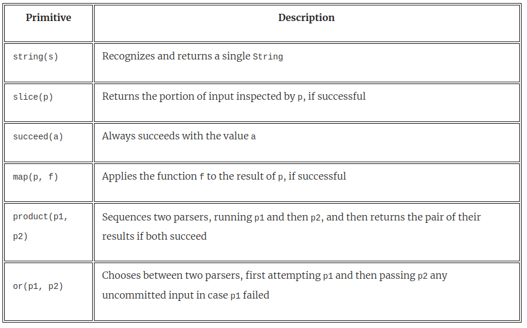
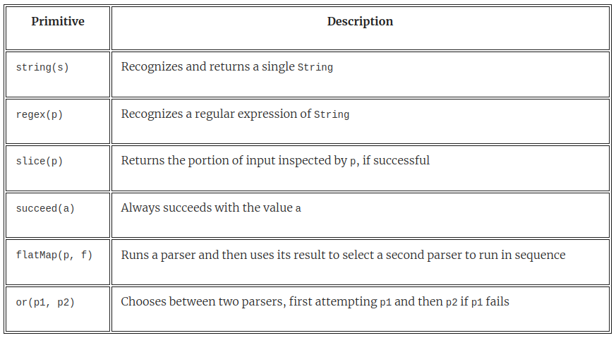
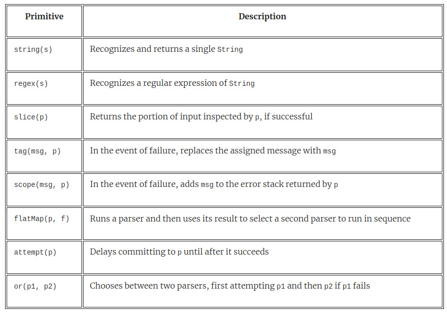

= 9 Parser combinators
:toc:
:icons: font
:url-quickref: https://livebook.manning.com/book/functional-programming-in-kotlin/chapter-9/

{url-quickref}[See chapter online chapter].

This chapter covers

* An algebraic design approach to libraries
* Primitives vs. higher-level combinators
* Using combinators to achieve design goals
* Improving library ease of use with syntactic sugar
* Postponing combinator implementation by first focusing on algebra design

In this chapter, we work through the _design of a combinator library for creating parsers_. We’ll use JSON parsing as a motivating use case.

====
What is a parser?
A parser is a specialized program that takes unstructured data (such as text or a stream of symbols, numbers, or tokens) as _input_ and _outputs_ a structured representation of that data.

bvb a parser that takes JSON document and turns it into a tree-like data structure.

In a _**parser combinator library**_, a parser doesn’t have to parse entire documents. It can do something as elementary as recognizing a single character in the input.

We then use _combinators_ to assemble composite parsers from elementary ones.

====

This chapter introduces a design approach that we call *algebraic design*.

Approach:

. designing our interface first,
. along with associated laws, and
. letting the combination of these guide our choice of data type representations.

== 9.1 Designing an algebra

> we defined algebra to mean a _collection of functions operating over data types, along with a set of laws specifying relationships between these functions_.

We’ll start with the algebra (including its laws) and decide on a representation later.

-> algebraic design

=== 9.1.1 A parser to recognize single characters

For simplicity and for speed, our library will create parsers that _operate on strings as input_.

A good, straightforward domain to start with is parsing various combinations of repeated letters and gibberish words like abracadabra and abba. ... simple examples help us ignore extraneous details and focus on the essence of the problem.

==== Single char

Let’s start with the simplest of parsers: one that recognizes the single-character input 'a'.

[source, kotlin]
----
fun char(c: Char): Parser<Char>
----

-> A type called `Parser` that is parameterized on a single parameter _indicating the result type of Parser_.

-> Running a parser shouldn’t simply yield a yes/no response — if it succeeds, we want to get a result that has some useful type; and if it fails, we expect information about the failure.

-> The char('a') parser will succeed only if the input is exactly the character 'a', and it will return that same character 'a' as its result.

Let’s invent another function to do so:

[source, kotlin]
----
fun <A> run(p: Parser<A>, input: String): Either<PE, A>
----

At this point, we don’t care about the representation of `PE` (short for parse error)

[source, kotlin]
----
interface Parsers<PE> {

    interface Parser<A>

    fun char(c: Char): Parser<Char>

    fun <A> run(p: Parser<A>, input: String): Either<PE, A>

}
----

-> A top-level interface called `Parsers` is introduced.

Returning to the char function, we should satisfy an obvious law: *for any `c` of type `Char`*,

[source, kotlin]
----
run(char(c), c.toString()) == Right(c)
----

==== Strings
Let’s continue. We can recognize the single character 'a', but what if we want to recognize the string "abracadabra"? We don’t have a way of recognizing entire strings yet...

[source, kotlin]
----
fun string(s: String): Parser<String>
----

Likewise, this should satisfy an obvious law: *for any String s*,

[source, kotlin]
----
run(string(s), s) == Right(s)
----

==== Or String

What if we want to recognize _either string "abra" or "cadabra"_?

[source, kotlin]
----
fun orString(s1: String, s2: String): Parser<String>
----

But *choosing between two parsers* seems like something that would be more useful in a general way regardless of their result type.

[source, kotlin]
----
fun <A> or(pa: Parser<A>, pb: Parser<A>): Parser<A>
----

We expect that `or(string("abra"), string("cadabra"))` will succeed whenever either string parser succeeds:

[source, kotlin]
----
run(or(string("abra"), string("cadabra")), "abra") == Right("abra")
run(or(string("abra"), string("cadabra")), "cadabra") == Right("cadabra")
----

-> difficult for the reader to understand. Let’s do some work on our presentation: *infix syntax*

[source, kotlin]
----
interface Parsers<PE> {

    interface Parser<A>

    fun string(s: String): Parser<String>

    fun <A> or(a1: Parser<A>, a2: Parser<A>): Parser<A>

    infix fun String.or(other: String): Parser<String> =
        or(string(this), string(other))

    fun <A> run(p: Parser<A>, input: String): Either<PE, A>
}
----

[source, kotlin]
----
run("abra" or "cadabra", "abra") == Right("abra")
----

=== 9.1.3 A parser to recognize repetition

-> a way of talking about the repetition: how would we recognize three repetitions of our "abra" or "cadabra" parser?

-> let’s add a combinator:

[source, kotlin]
----
fun <A> listOfN(n: Int, p: Parser<A>): Parser<List<A>>
----

We made `listOfN` _parametric_ in the choice of `A` since it doesn’t seem like it should care whether we have a `Parser<String>`, a `Parser<Char>`.

-> some examples of what we expect from `listOfN` expressed through laws:

[source, kotlin]
----
run(listOfN(3, "ab" or "cad"), "ababab") == Right("ababab")
run(listOfN(3, "ab" or "cad"), "cadcadcad") == Right("cadcadcad")
run(listOfN(3, "ab" or "cad"), "ababcad") == Right("ababcad")
run(listOfN(3, "ab" or "cad"), "cadabab") == Right("cadabab")
----

==== Additional tasks
Here are additional parsing tasks to consider, along with some guiding questions:

* A `Parser<Int>` that recognizes zero or more 'a' characters and whose result value is the number of 'a' characters it has seen.
+
For instance, given `"aa"`, the parser results in `2`; given `""` or `"b123"` (a string not starting with 'a'), it results in `0`; and so on.
+
Is this defined in terms of the same combinators as the parser for 'a' repeated zero or more times? The parser should fail when given a string without a starting 'a'.
+
How would you like to handle error reporting in this case? Could the API give an explicit message like "Expected one or more 'a'" in the case of failure?
* A parser that recognizes zero or more 'a', followed by one or more 'b', resulting in a pair of counts of characters seen.
+
For instance, given `"bbb"`, we get `Pair(0,3)`; given `"aaaab"`, we get `Pair(4,1)`; and so on.

Some additional considerations:

* If we’re trying to parse a sequence of zero or more "a" and are only interested in the number of characters seen, it seems inefficient to have to build up a `List<Char>`, only to throw it away and extract the `length`. Could something be done about this?
* Are the various forms of repetition in our algebra _primitives_, or could they be defined in terms of something more straightforward?
* Earlier, we introduced a type parameter `PE` representing parse errors, but we haven’t chosen any representation or functions for its API so far. Our algebra also doesn’t have a way to let the programmer control what errors are reported. This seems like a limitation, given that we’d like meaningful error messages from our parsers. Can something be done about this?
* Does `a or (b or c)` mean the same thing as `(a or b) or c`? If yes, is this a primitive law for our algebra, or is it implied by something simpler?
* Try to come up with a set of laws to specify our algebra. The laws don’t necessarily need to be complete; just write down some laws that you expect should hold for any Parsers implementation.

====
The advantages of _algebraic design_

When you design the algebra of a library first, representations for the data types of the algebra don’t matter as much. As long as they support the required laws and functions, you don’t even need to make your representations public.

A type is given meaning based on its relationship to other types (which are specified by the set of functions and their laws), rather than its internal representation.

This viewpoint is often associated with _category theory_, a branch of mathematics.
====

== 9.2 One possible approach to designing an algebra

=== 9.2.1 Counting character repetition

Let’s consider the parser that _recognizes zero or more repetitions of the character 'a'_ and _returns the number of characters_ it has seen.

[source, kotlin]
----
fun <A> many(pa: Parser<A>): Parser<List<A>>
----

We could change the `many` combinator to return a `Parser<Int>`, but that feels _too specific_. Undoubtedly there will be occasions when we care about more than just the list length.

-> Better to introduce another combinator that should be familiar by now, `map`:

[source, kotlin]
----
fun <A, B> map(pa: Parser<A>, f: (A) -> B): Parser<B>
----

We can now define our parser as follows:

[source, kotlin]
----
map(many(char('a'))) { it.size }
----

-> extension functions:
[source, kotlin]
----
fun <A> Parser<A>.many(): Parser<List<A>>

fun <A, B> Parser<A>.map(f: (A) -> B): Parser<B>
----

With these combinators in place, our new parser can be expressed as `numA`, followed by its proof:

[source, kotlin]
----
val numA: Parser<Int> = char('a').many().map { it.size }

run(numA, "aaa") == Right(3)
run(numA, "b") == Right(0)
----

=== Law of map

We have a strong expectation for the behavior of map:

* It should merely transform the result value if the `Parser` was successful, and it should *not examine additional input characters*.
* Also, a failing parser can’t become a successful one via `map` or vice versa. In general, we expect `map` to be *structure preserving*. Let’s formalize this by stipulating the now-familiar law:

[source, kotlin]
----
map(p) { a -> a } == p
----

How should we document this law? Let’s use our *property-based testing library* here!

[source, kotlin]
----
object ParseError

abstract class Laws : Parsers<ParseError> {
    private fun <A> equal(
        p1: Parser<A>,
        p2: Parser<A>,
        i: Gen<String>
    ): Prop =
        forAll(i) { s -> run(p1, s) == run(p2, s) }

    fun <A> mapLaw(p: Parser<A>, i: Gen<String>): Prop =
        equal(p, p.map { a -> a }, i)
}
----

We now have a way to test whether our combinator holds true for the specified law.

==== char in terms of string
Incidentally, if we consider `string` to be one of our core primitive functions, combined with `map`, we can quickly implement `char` in terms of `string`:

[source, kotlin]
----
fun string(s: String): Parser<String>

fun char(c: Char): Parser<Char> = string(c.toString()).map { it[0] }
----

==== succeed in terms of string
Another combinator called `succeed` can be defined in terms of `string` and `map`. This parser _always succeeds with the value `a`, regardless of the input string_ - since string("") will always succeed, even if the input is empty:

[source, kotlin]
----
fun <A> succeed(a: A): Parser<A> = string("").map { a }
----

Does this combinator seem familiar to you?

We can specify its behavior with a *law*:

[source, kotlin]
----
run(succeed(a), s) == Right(a)
----

=== 9.2.2 Slicing and nonempty repetition

The combination of `many` and `map` certainly lets us express the parsing task of counting the number of 'a' characters that we have seen.

-> it seems *inefficient* to construct a `List<Char>` only to discard its values and extract its `length`.

-> It would be nice to run a `Parser` purely to see what portion of the input string it examines.

-> Let’s come up with a combinator for that very purpose, called slice:

[source, kotlin]
----
fun <A> slice(pa: Parser<A>): Parser<String>
----

We call this combinator `slice` since we intend to _return the portion of the input string examined by the parser, if successful_.

As an example:

[source, kotlin]
----
run(slice(('a' or 'b').many()), "aaba") == Right("aaba")
----

-> We ignore the list accumulated by `many` and simply return the portion of the input string matched by the parser.

Our parser that counts `'a'` characters can now be written as follows:

[source, kotlin]
----
char('a').many().slice().map { it.length }
----

NOTE: there is no implementation yet. We’re merely coming up with our desired interface.

-> But `slice` does put a _constraint_ on the implementation: even if the parser `p.many().map { it.size() }` will generate an intermediate list when run, `p.many() .slice().map { it.length }` will not.

-> This is a strong hint that `slice` is *primitive* since it must have access to the internal representation of the parser.

==== One or more
What if we want to recognize _one or more 'a' characters_?

First, we introduce a new combinator for this purpose, called `many1`:

[source, kotlin]
----
fun <A> many1(p: Parser<A>): Parser<List<A>>
----

It feels like `many1` shouldn’t have to be primitive but must be defined in terms of `many`.

-> In fact, `many1(p)` is just `p` followed by `many(p)`.

-> So it seems we need a *way to run one parser followed by another, assuming the first is successful*.

==== Product
[source, kotlin]
----
fun <A, B> product(pa: Parser<A>, pb: Parser<B>): Parser<Pair<A, B>>
----

We can now add an _infix_ product extension method to _Parser<A>_ that allows us to express `pa product pb`:

[source, kotlin]
----
infix fun <A, B> Parser<A>.product(pb: Parser<B>): Parser<Pair<A, B>>
----

==== map2

Using `product`, implement the now-familiar combinator `map2`.

In turn, use this to implement `many1` in terms of `many`.

[source, kotlin]
----
override fun <A, B, C> map2(
    pa: Parser<A>,
    pb: () -> Parser<B>,
    f: (A, B) -> C
): Parser<C> =

    SOLUTION_HERE()

override fun <A> many1(p: Parser<A>): Parser<List<A>> =

    SOLUTION_HERE()
----
IMPORTANT: xref:../../../test/kotlin/chapter9/exercises/ex1/listing.kt[]

With `many1`, we can now implement the parser for _zero or more 'a' followed by one or more 'b'_:

[source, kotlin]
----
char('a').many().slice().map { it.length }
  product
    char('b').many1().slice().map { it.length }
----

Try coming up with laws to specify the behavior of product.

NOTE: xref:../../../test/kotlin/chapter9/solutions/ex2/listing.kt[]

==== many
Now that we have `map2`, is `many` really primitive?

Let’s think about what `many(p)` will do.

*It will try running `p` followed by `many(p)` again, and again, and so on until the attempt to parse `p` fails. It will accumulate the results of all successful runs of `p` into a list. As soon as `p` fails, the parser will return the empty List.*

See if you can define `many` in terms of `or`, `map2`, and `succeed`.

[source, kotlin]
----
fun <A, B, C> map2(
    pa: Parser<A>,
    pb: Parser<B>,
    f: (A, B) -> C
): Parser<C> = TODO()

fun <A> many(pa: Parser<A>): Parser<List<A>> =
----

IMPORTANT: xref:../../../test/kotlin/chapter9/exercises/ex3/listing.kt[]

NOTE: xref:../../../test/kotlin/chapter9/solutions/ex3/listing.kt[]

==== listOfN
Implement the `listOfN` combinator introduced earlier using `map2` and `succeed`.

[source, kotlin]
----
fun <A> listOfN(n: Int, pa: Parser<A>): Parser<List<A>> =
----

IMPORTANT: xref:../../../test/kotlin/chapter9/exercises/ex4/listing.kt[]

NOTE: xref:../../../test/kotlin/chapter9/solutions/ex4/listing.kt[]

==== Defer
There’s a problem with the implementation of `many`. We’re calling `many` recursively in the second argument to `map2`, which is a *strict* evaluation of its second argument:

[source, kotlin]
----
many(p)
map2(p, many(p)) { a, la -> a cons la }
map2(p, map2(p, many(p)) { a, la -> a cons la }) { a, la ->
    a cons la
}
----

This indicates that we need to make `product` and `map2` *non-strict in their second arguments*:

[source, kotlin]
----
fun <A, B> product(
    pa: Parser<A>,
    pb: () -> Parser<B>
): Parser<Pair<A, B>> = TODO()

fun <A, B, C> map2(
    pa: Parser<A>,
    pb: () -> Parser<B>,
    f: (A, B) -> C
): Parser<C> =
    product(pa, pb).map { (a, b) -> f(a, b) }
----

We could also deal with non-strictness using a separate combinator.

Provide a new combinator called `defer`.

NOTE: xref:../../../test/kotlin/chapter9/solutions/ex5/listing.kt[]

Because `map2` draws on the functionality of `product`, it should be non-strict in its second argument, too. If the first Parser fails, the second won’t even be consulted.

==== or

We now have good combinators for parsing *one thing followed by another* or *multiple things of the same kind in succession*. But since we’re considering whether combinators should be _non-strict_, let’s revisit the `or` combinator once again:

[source, kotlin]
----
fun <A> or(pa: Parser<A>, pb: Parser<A>): Parser<A>
----

We’ll assume that `or` is left-biased, meaning it tries `p1` on the input and then tries `p2` only if `p1` fails:

[source, kotlin]
----
fun <A> or(pa: Parser<A>, pb: () -> Parser<A>): Parser<A>
----

== 9.3 Handling context sensitivity

A combinator that allows us to _pass context on to the following combinator_. We call this ability for a combinator to pass state *context sensitivity*.

Using these _primitives_, we can express various forms of repetition (`many`, `listOfN`, and `many1`) as well as combinators like `char` and `map2`.

-> sufficient for parsing any context-free grammar, including JSON!

Suppose we want to parse a single digit like `'4'`, followed by as many `'a'` characters as that digit.

Examples of this kind of input are `"0"`, `"1a"`, `"2aa"`, `"4aaaa"`, and so on.

This is an example of a _context-sensitive_ grammar, and it *can’t* be expressed with the `product` primitive we’ve defined already: The choice of the _second_ parser depends on the result of the first. In other words, *the second parser depends on the context of the first*.

=== flatMap:

[source, kotlin]
----
fun <A, B> flatMap(pa: Parser<A>, f: (A) -> Parser<B>): Parser<B>
----

Can you see how this combinator solves the problem of _context sensitivity_? It provides an ability to sequence parsers, where each parser in the chain depends on the output of the previous one.

Using `flatMap` and any other combinators, write the context-sensitive parser we couldn’t express earlier: *parse a single digit like `'4'`, followed by as many `'a'` characters as that digit*. The `Parser<Int>` should return the *number of characters read*.

You can use a new primitive called `regex` to parse digits, which promotes a regular expression String to a `Parser<String>`.

IMPORTANT: xref:../../../test/kotlin/chapter9/exercises/ex6/listing.kt[]

Implement `product` and `map2` in terms of `flatMap` and `map`.

IMPORTANT: xref:../../../test/kotlin/chapter9/exercises/ex7/listing.kt[]

`map` is no longer primitive. Express it in terms of `flatMap` and/or other combinators.

IMPORTANT: xref:../../../test/kotlin/chapter9/exercises/ex8/listing.kt[]

====
We have now introduced a new primitive called `flatMap` that enables context-sensitive parsing and allows us to implement `map` and `map2`.
====

Our list of primitives has now shrunk to six:

`string`, `regex`, `slice`, `succeed`, `or`, and `flatMap`.

Even though we have fewer primitives, we have more capabilities than before because we adopted the more general `flatMap` in favor of `map` and `product`.

This new power tool enables us to parse arbitrary *context-free grammars* like JSON and *context-sensitive grammars*, including highly complex ones like C++ and Perl!

== 9.4 Writing a JSON parser

NOTE: We haven’t implemented our algebra yet, nor do we have combinators for good error reporting.

=== 9.4.1 Defining expectations of a JSON parser

The final outcome will be a structure that looks something like the following.

[source, kotlin]
----
object JSONParser : ParsersImpl<ParseError>() {
    val jsonParser: Parser<JSON> = TODO()
}
----

> ...it’s common FP practice to define an algebra and explore its expressiveness prior to defining an implementation. ... This algebra-first design approach is radically different from what we have done so far in this book but is probably the most important lesson in this chapter.

=== 9.4.2 Reviewing the JSON format

Example JSON object that can be parsed

[source, json]
----
{
  "Company name" : "Microsoft Corporation",
  "Ticker": "MSFT",
  "Active": true,
  "Price": 30.66,
  "Shares outstanding": 8.38e9,
  "Related companies": [ "HPQ", "IBM", "YHOO", "DELL", "GOOG" ]
}
----

We’ll write a rather dumb parser that simply parses a _syntax tree_ from the document without doing any further processing. Next, we’ll need a representation for a parsed JSON document. Let’s introduce a _data type_ for this purpose.

[source, kotlin]
----
sealed class JSON {
    object JNull : JSON()
    data class JNumber(val get: Double) : JSON()
    data class JString(val get: String) : JSON()
    data class JBoolean(val get: Boolean) : JSON()
    data class JArray(val get: List<JSON>) : JSON()
    data class JObject(val get: Map<String, JSON>) : JSON()
}
----

=== 9.4.3 A JSON parser

In addition, we have used these primitives to define several combinators like `map`, `map2`, `many`, and `many1`.

At this point, you are going to take over the design process. You’ll be creating `Parser<JSON>` from scratch using the primitives we’ve defined.

Here are some basic guidelines to help you in the exercise:

* Any general-purpose combinators you discover can be declared in the `Parsers` abstract class directly. These are top-level declarations with no implementation.
* Any syntactic sugar can be placed in another abstract class called `ParsersDsl` that extends from `Parsers`. Make generous use of `infix`, along with anything else in your Kotlin bag of tricks to make the final `JSONParser` as easy to use as possible. The functions implemented here should all delegate to declarations in `Parsers`.
* Any JSON-specific combinators can be added to `JSONParser`, which extends `ParsersDsl`.
* You’ll probably want to introduce combinators that make it easier to parse the tokens of the JSON format (like string literals and numbers). For this, you can use the `regex` primitive we introduced earlier. You can also add a few primitives like `letter`, `digit`, `whitespace`, and so on to build up your token parsers.

NOTE: This exercise is about defining the algebra consisting of primitive and combinator declarations only. No implementations should appear in the final solution.

The basic skeleton of what you will be building should look something like this:

[source, kotlin]
----
abstract class Parsers<PE> {

    // primitives

    internal abstract fun string(s: String): Parser<String>

    internal abstract fun regex(r: String): Parser<String>

    internal abstract fun <A> slice(p: Parser<A>): Parser<String>

    internal abstract fun <A> succeed(a: A): Parser<A>

    internal abstract fun <A, B> flatMap(
        p1: Parser<A>,
        f: (A) -> Parser<B>
    ): Parser<B>

    internal abstract fun <A> or(
        p1: Parser<out A>,
        p2: () -> Parser<out A>
    ): Parser<A>

    // other combinators here
}

abstract class ParsersDsl<PE> : Parsers<PE>() {
    // syntactic sugar here
}

abstract class JSONParsers : ParsersDsl<ParseError>() {
    val jsonParser: Parser<JSON> =

        SOLUTION_HERE()
}
----

IMPORTANT: xref:../../../test/kotlin/chapter9/exercises/ex9/listing.kt[]

NOTE: xref:../../../test/kotlin/chapter9/solutions/ex9/listing.kt[]

== 9.5 Surfacing errors through reporting

...error reporting.

In this section, we discover a set of combinators for expressing what errors are reported by a `Parser`.

* Given the following parser, what sort of error would you like to report given the input `"abra cAdabra"` (note the capital `'A'`)?
+
[source, kotlin]
----
val spaces = string(" ").many()

string("abra") product spaces product string("cadabra")
----
+
Would a simple `Expected 'a'` do?
+
Or how about `Expected "cadabra"`?
+
What if you wanted to choose a different error message, along the lines of `"Magic word incorrect, try again!"`?

* Given `a` or `b`, if `a` fails on the input, do we always want to run `b`?
+
Are there cases where we might not want to run `b`?
+
If there are such cases, can you think of additional combinators that would allow the programmer to specify when or should consider the second parser?

* How do you want to handle _reporting the location_ of errors?
* Given `a or b`, if `a` and `b` both fail on the input, should we support reporting both errors? And do we always want to report both errors? Or do we want to give the programmer a way to specify which of the two errors is reported?

=== 9.5.1 First attempt at representing errors

We can introduce a primitive combinator for this called `tag`:

[source, kotlin]
----
fun <A> tag(msg: String, p: Parser<A>): Parser<A>
----

The intended meaning of `tag` is that *if p fails, its `ParseError` will somehow incorporate `msg`*.

What does this mean, exactly?

Well, we could do the _simplest thing possible_ and assume that _ParseError is a type alias for String_ and that the returned ParseError will equal the tag.

But we’d like our parse error to also tell us _where_ the problem occurred. Let’s tentatively add this concept to our algebra; call it `Location`.

[source, kotlin]
----
data class Location(val input: String, val offset: Int = 0) {

    private val slice by lazy { input.slice(0..offset + 1) }

    val line by lazy { slice.count { it == '\n' } + 1 }

    val column by lazy {
        when (val n = slice.lastIndexOf('\n')) {
            -1 -> offset + 1
            else -> offset - n
        }
    }
}

fun errorLocation(e: ParseError): Location

fun errorMessage(e: ParseError): String
----

What about `Location`?

...still seems a bit fuzzy at the moment—if we have a or b, and both parsers fail on the input, which location will be reported?

=== 9.5.2 Accumulating errors through error nesting

Is the `tag` combinator sufficient for all our error-reporting needs?

Not quite:

[source, kotlin]
----
tag("first magic word", string("abra"))
  product
    string(" ").many()
      product
        tag("second magic word", string("cadabra"))
----

What sort of `ParseError` would we like to get back from `run(p, "abra cAdabra")`? Note the capital `A` in `cAdabra`. The immediate cause for an error is this capital 'A' instead of the expected lowercase 'a'.

* would be helpful to report exact location
* we also have more contextual information: the immediate error occurred in the Parser tagged _"second magic word"_.
* the error message should tell us that while parsing "cAdabra" using "second magic word", there was an unexpected capital 'A'.
* the top-level parser (p in this case) might be able to provide an even higher-level description of what the parser was doing when it failed.

Therefore, let’s provide a way to *nest tags*.

[source, kotlin]
----
fun <A> scope(msg: String, p: Parser<A>): Parser<A>
----

Despite `scope` having the same method declaration as `tag`, the implementation of `scope` doesn’t throw away the `tag`(s) attached to `p` — *it merely adds additional information if p fails*.

Let’s specify what this means.

First, we modify the functions that pull information out of a ParseError. Rather than containing just a single `Location` and `String` message, we should get a `List<Pair<Location, String>>`.

[source, kotlin]
----
data class ParseError(val stack: List<Pair<Location, String>>)
----

This is a *stack of error messages indicating what the `Parser` was doing when it failed*.

We can now specify what `scope` does when it encounters multiple errors: `if run(p, s)` is `Left(e1)`, then `run(scope(msg, p), s))` is `Left(e2)`, where `e2.stack.head` will contain `msg`, and `e2.stack.tail` will contain `e1`.

It does seem like `ParseError` will be sufficient for most purposes. Let’s pick this as our concrete representation for use in the return type of run in the `Parsers` interface:

[source, kotlin]
----
fun <A> run(p: Parser<A>, input: String): Either<ParseError, A>
----

=== 9.5.3 Controlling branching and backtracking

...one last concern regarding error reporting: when an error occurs inside an `or` combinator, we need some way of determining which error(s) to report. ... we sometimes want to allow the programmer to control this choice.

[source, kotlin]
----
val spaces = string(" ").many()

val p1 = scope("magic spell") {
    string("abra") product spaces product string("cadabra")
}
val p2 = scope("gibberish") {
    string("abba") product spaces product string("babba")
}

val p = p1 or p2
----

What `ParseError` would we like to get back from `run(p, "abra cAdabra")`?

Both branches of the `or` will produce errors on the input.

* The "gibberish" parser will report an error due to expecting the first word to be "abba",
* the "magic spell" parser will report an error due to the accidental capitalization in "cAdabra".

Which of these errors do we want to report back to the user?

...it appears we need a _primitive_ to let the programmer indicate when to commit to a particular parsing branch.

Recall that we loosely assigned `p1 or p2` to mean: _“try running p1 on the input, and then try running p2 on the same input if p1 fails.”_

We can change its meaning to _“try running p1 on the input, and if it fails in an uncommitted state, try running p2 on the same input; otherwise, report the failure.”_

This is useful for more than just providing good error messages—it also improves efficiency by letting the implementation avoid examining lots of possible parsing branches.

One common solution to this problem is to have all parsers _**commit by default**_ if they examine at least one character to produce a result.

We now introduce a combinator called `attempt`, which _delays committing to a parse_:

[source, kotlin]
----
fun <A> attempt(p: Parser<A>): Parser<A>
----

It should satisfy something like the following situation:

[source, kotlin]
----
attempt(p1.flatMap { _ -> fail }) or p2 == p2
----

This is not exactly equality; even though we want to run p2 if the attempted parser p1 fails, we may want p2 to somehow incorporate the errors from both branches if it fails

Here, `fail` is a parser that always fails. In fact, we could introduce this as a _primitive_ combinator if we like.

`attempt`: even if `p1` fails midway through examining the input, `attempt` reverts the commit to that parse and allows `p2` to be run.

The `attempt` combinator can be used whenever dealing with such ambiguous grammar. Multiple tokens may have to be examined before the ambiguity can be resolved, and that parsing can commit to a single branch.

As an example, we might write this:

[source, kotlin]
----
(
  attempt(
    string("abra") product spaces product string("abra")
  ) product string("cadabra")
) or (
  string("abra") product spaces product string("cadabra!")
)
----

Suppose this parser is run on `"abra cadabra!"`. After parsing the first "abra", we don’t know whether to expect another "abra" (the first branch) or "cadabra!" (the second branch).

By wrapping an `attempt` around `string("abra") product spaces product string("abra")`, we allow the _second_ branch to be considered up until we’ve finished parsing the second "abra", at which point we commit to that branch.

Can you think of any other primitives that might be useful for specifying what error(s) in an or chain are reported?

NOTE: xref:../../../test/kotlin/chapter9/solutions/ex10/listing.kt[]

== 9.6 Implementing the algebra

This entire chapter has focused on building up an algebra of definitions without implementing a single thing! This has culminated in a final definition of Parser<JSON>.

List of primitives:

The list has changed somewhat by adding `tag`, `scope`, and `attempt`.

The algebra we’ve designed places strong _constraints_ on possible representations. We should be able to come up with a simple, purely functional representation of `Parser` that can be used to implement the Parsers interface.

Let’s express the top-level constructs used as a starting point for our implementation.

[source, kotlin]
----
interface Parser<A>

data class ParseError(val stack: List<Pair<Location, String>>)

abstract class Parsers<PE> {
    abstract fun <A> or(p1: Parser<A>, p2: Parser<A>): Parser<A>
}

open class ParsersImpl<PE>() : Parsers<PE>() {
    override fun <A> or(p1: Parser<A>, p2: Parser<A>): Parser<A> = TODO()
}

abstract class ParserDsl<PE> : ParsersImpl<PE>() {
    infix fun <A> Parser<A>.or(p: Parser<A>): Parser<A> =
        this@ParserDsl.or(this, p)
}

object Example : ParserDsl<ParseError>() {
    init {
        val p1: Parser<String> = TODO()
        val p2: Parser<String> = TODO()
        val p3 = p1 or p2
    }
}
----

=== 9.6.1 Building up the algebra implementation gradually

...we’ll build it up gradually. We will do so by inspecting the primitives of the algebra and then reasoning about the information that will be required to support each one.

==== string

[source, kotlin]
----
fun string(s: String): Parser<String>
----

We also know that we need to support the function `run`:

[source, kotlin]
----
fun <A> run(p: Parser<A>, input: String): Either<PE, A>
----

As a _first pass_, we can assume that our `Parser` is simply the implementation of the `run` function:

[source, kotlin]
----
typealias Parser<A> = (String) -> Either<ParseError, A>
----
We can use this to implement the string primitive as follows.

[source, kotlin]
----
override fun string(s: String): Parser<String> =
    { input: String ->
        if (input.startsWith(s))
            Right(s)
        else Left(Location(input).toError("Expected: $s"))
    }

private fun Location.toError(msg: String) =
    ParseError(listOf(this to msg))
----

The `else` branch of string has to build up a `ParseError`. ...we’ve introduced a _helper_ extension function called `toError` on `Location`.

=== 9.6.2 Sequencing parsers after each other

We have a representation for Parser that at least supports `string`.

Let’s move on to the sequencing of parsers.

Unfortunately, to represent a parser like `"abra" product "cadabra"`, our existing representation isn’t going to suffice. If the parse of `"abra"` is successful, then we want to _consider those characters consumed_ before we run the `"cadabra"` parser on the remaining characters. So to support sequencing, we *require a way of letting a Parser indicate how many characters it consumed*.

Capturing this turns out to be pretty easy, considering that `Location` contains the entire input string and an offset into this string.

[source, kotlin]
----
typealias Parser<A> = (Location) -> Result<A>

sealed class Result<out A>
data class Success<out A>(val a: A, val consumed: Int) : Result<A>()
data class Failure(val get: ParseError) : Result<Nothing>()
----

We just introduced a richer alternative data type called `Result` instead of using a simple Either as before.

In the event of `success`, we return a value of type `A` and the number of characters of input consumed.  The caller can then use this count to update the `Location` state.

This type is starting to get to the essence of what a `Parser` truly is—it’s a kind of *state action* that can fail. It receives an input state and, on success, returns a value and enough information to control how the state should be updated.

Implement `string`, `regex`, `succeed`, and `slice` for this representation of `Parser`. Some private helper function stubs have been included to lead you in the right direction.

NOTE: `slice` is probably less efficient than it could be since it must still construct a value only to discard it.

[source, kotlin]
----
abstract class Parser : ParserDsl<ParseError>() {
    override fun string(s: String): Parser<String> =

    private fun firstNonMatchingIndex(
        s1: String,
        s2: String,
        offset: Int
    ): Option<Int> =

    private fun State.advanceBy(i: Int): State =

    override fun regex(r: String): Parser<String> =

    private fun String.findPrefixOf(r: Regex): Option<MatchResult> =

    override fun <A> succeed(a: A): Parser<A> =

    override fun <A> slice(p: Parser<A>): Parser<String> =

    private fun State.slice(n: Int): String =
}
----

IMPORTANT: xref:../../../test/kotlin/chapter9/exercises/ex11/listing.kt[]

NOTE: xref:../../../test/kotlin/chapter9/solutions/ex11/listing.kt[]

=== 9.6.3 Capturing error messages through labeling parsers

...let’s look at `scope` next. We want to push a new message onto the `ParseError` stack in the event of `failure`. Let’s introduce a helper function for this on `ParseError`. We’ll call it `push`.

[source, kotlin]
----
fun ParseError.push(loc: Location, msg: String): ParseError =
  this.copy(stack = (loc to msg) cons this.stack)
----

Now that we have this, we can implement `scope` using the `mapError` extension method on `Result` that we will describe next.

[source, kotlin]
----
fun <A> scope(msg: String, pa: Parser<A>): Parser<A> =
  { state -> pa(state).mapError { pe -> pe.push(state, msg) } }
----

The `mapError` extension method allows the transformation of an error in case of failure.

[source, kotlin]
----
fun <A> Result<A>.mapError(f: (ParseError) -> ParseError): Result<A> =
  when (this) {
    is Success -> this
    is Failure -> Failure(f(this.get))
}
----

Because we push onto the stack after the inner parser has returned, the bottom of the stack will contain more detailed messages that occurred later in parsing.

For example, `if scope(msg1, a product scope(msg2, b))` fails while parsing `b`, the first error on the stack will be `msg1`, followed by whatever errors were generated by `a`, then `msg2`, and finally, errors generated by `b`.

We can implement `tag` similarly, but instead of pushing onto the error stack, it *replaces what’s already there*. We can write this again using `mapError` and an extension on `ParseError`, also called `tag`

[source, kotlin]
----
fun <A> tag(msg: String, pa: Parser<A>): Parser<A> =
    { state ->
        pa(state).mapError { pe ->
            pe.tag(msg)
        }
    }
----

We added a helper extension function to `ParseError` that is also named `tag`. We’ll make a design decision that tag trims the error stack, cutting off more detailed messages from inner scopes, using only the most recent location from the bottom of the stack.

[source, kotlin]
----
fun ParseError.tag(msg: String): ParseError {

    val latest = this.stack.lastOrNone()

    val latestLocation = latest.map { it.first }

    return ParseError(latestLocation.map { it to msg }.toList())
}
----

=== 9.6.4 Recovering from error conditions and backtracking over them

Next, let’s look at `or` and `attempt`. If we consider what we’ve already learned about `or`, we can summarize its behavior as follows: _it should run the first parser, and if that fails in an uncommitted state, it should run the second parser on the same input_. We also said that consuming at least one character should result in a _committed parse_ and that `attempt(p)` _converts committed failures of p to uncommitted failures_.

We can support the behavior we want by simply adding a field to the `Failure` case of `Result`. All we need is a Boolean value indicating whether the parser failed in a committed state. Let’s call it `isCommitted`:

[source, kotlin]
----
data class Failure(
    val get: ParseError,
    val isCommitted: Boolean
) : Result<Nothing>()
----

The implementation of `attempt` now draws on this new information and cancels the commitment of any failures that occur. It does so by using a helper function called `uncommit`, which we can define on `Result`.

[source, kotlin]
----
fun <A> attempt(p: Parser<A>): Parser<A> = { s -> p(s).uncommit() }

fun <A> Result<A>.uncommit(): Result<A> =
    when (this) {
        is Failure ->
            if (this.isCommitted)
                Failure(this.get, false)
            else this
        is Success -> this
    }
----

Now the implementation of `or` can simply check the `isCommitted` flag before running the second parser.

Consider the parser `x or y`:

* if x succeeds, then the whole expression succeeds.
* If x fails in a committed state, we fail early and skip running y.
* Otherwise, if x fails in an uncommitted state, we run y and ignore the result of x.

[source, kotlin]
----
fun <A> or(pa: Parser<A>, pb: () -> Parser<A>): Parser<A> =
    { state ->
        when (val r: Result<A> = pa(state)) {
            is Failure ->
                if (!r.isCommitted) pb()(state)
                else r
            is Success -> r
        }
    }
----

=== 9.6.5 Propagating state through context-sensitive parsers

Now for the final primitive in our list: `flatMap`.

Recall that `flatMap` enables context-sensitive parsers by allowing the selection of a second parser to depend on the result of the first parser.

The implementation is simple, as we advance the location before calling the second parser. Again we will use a helper function, this time called `advanceBy`, on `Location`. Despite this being simple, there is one caveat to be dealt with. If the first parser consumes any characters, we ensure that the second parser is committed using a helper function called `addCommit` on `ParseError`.

[source, kotlin]
----
fun <A, B> flatMap(pa: Parser<A>, f: (A) -> Parser<B>): Parser<B> =
    { state ->
        when (val result = pa(state)) {
            is Success ->
                f(result.a)(state.advanceBy(result.consumed))
                    .addCommit(result.consumed != 0)
                    .advanceSuccess(result.consumed)
            is Failure -> result
        }
    }
----

In `advanceBy` on Location, we increment the `offset`:

[source, kotlin]
----
fun Location.advanceBy(n: Int): Location =
    this.copy(offset = this.offset + n)
----

The `addCommit` function on `ParseError` is equally straightforward, ensuring that the committed state is updated if it was not already committed:

[source, kotlin]
----
fun <A> Result<A>.addCommit(commit: Boolean): Result<A> =
    when (this) {
        is Failure ->
            Failure(this.get, this.isCommitted || commit)
        is Success -> this
    }
----

The final piece of the puzzle is the `advanceSuccess` function on `Result`, which is responsible for incrementing the number of consumed characters of a successful result. We want the total number of characters consumed by `flatMap` to be the sum of the consumed characters of the parser pa and the parser produced by f. We use `advanceSuccess` on the result of `f` to ensure that this adjustment is made:

[source, kotlin]
----
fun <A> Result<A>.advanceSuccess(n: Int): Result<A> =
    when (this) {
        is Success ->
            Success(this.a, this.consumed + n)
        is Failure -> this
    }
----

Implement `run` as well as any of the remaining primitives not yet implemented using our current representation of `Parser`. Try running your JSON parser on various inputs.

IMPORTANT: xref:../../../test/kotlin/chapter9/exercises/ex13/listing.kt[]

NOTE: xref:../../../test/kotlin/chapter9/solutions/ex13/listing.kt[]

You should now have working code, although unfortunately, you’ll find that it causes a stack overflow for significant inputs.

A straightforward solution is to provide a specialized implementation of `many` that avoids using a stack frame for each list element. Ensuring that any combinators that perform repetition are defined in terms of `many` solves this problem.

Come up with a good way to format a `ParseError` for human consumption. There are many choices to make, but a critical insight is that we typically want to combine or group tags attached to the exact location when presenting the error as a String for display.

IMPORTANT: xref:../../../test/kotlin/chapter9/exercises/ex14/listing.kt[]

NOTE: xref:../../../test/kotlin/chapter9/solutions/ex14/listing.kt[]

We could spend a lot more time improving and developing the example in this chapter, but we’ll leave it as is for now.

Although the parser combinator library isn’t the most crucial point that we’re trying to bring home in this chapter—it was really all about demonstrating the approach of algebra-first library design.

== 9.7 Conclusion

...We hope you’ve come away with an understanding of how to go about designing a functional library. More importantly, we also hope this part of the book inspires you to begin designing and building your own libraries based on domains that are of personal interest to you. Functional design isn’t something reserved only for experts. It should be part of the day-to-day work done by functional programmers at all levels of experience.

Summary:

* Algebraic library design establishes the interface with associated laws up front and then drives implementation.
* Primitives are simple combinators that don’t depend on others. They provide building blocks for more complex higher-order combinators.
* Algebraic design encourages the invention of primitives first, which allows the discovery of more complex combinators to follow.
* A combinator is said to be _context sensitive_ when it passes on state, allowing sequencing of combinators.
* A parser combinator may accumulate errors, which allows for surfacing an error report in case of failure.
* A parser may fail with an uncommitted state, which allows for backtracking and recovery from errors.
* Starting design with the algebra lets combinators specify information to the implementation.

